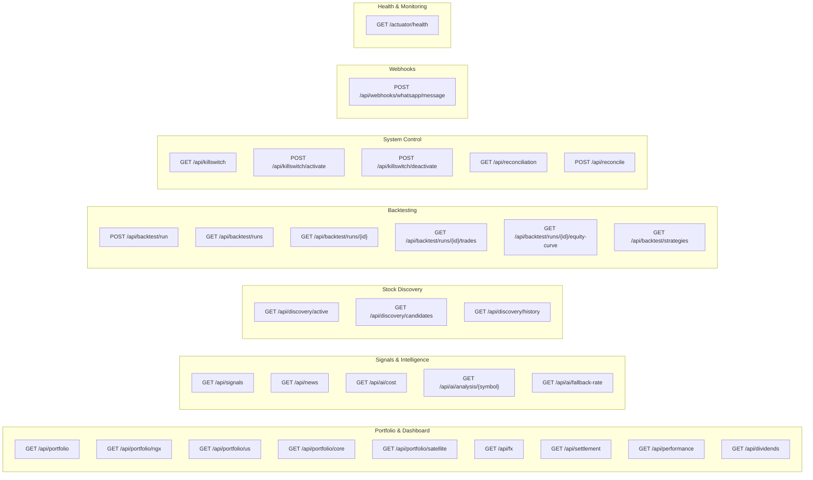
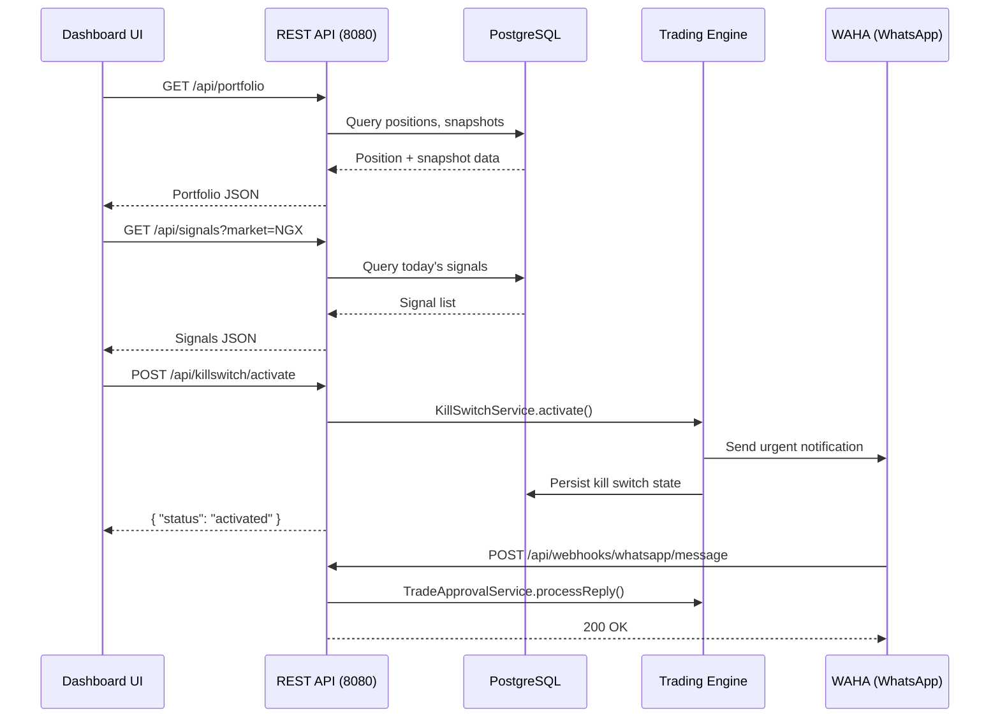

# API Reference

**Audience**: Frontend developers, integration engineers, and API consumers.

---

## Overview

The NGX Trading Bot exposes a REST API on port `8080` for dashboard consumption, backtest management, and system control. All responses are JSON. No authentication is currently required (designed for local/private network access).

**Base URL**: `http://localhost:8080`

### Endpoint Map



---

## Portfolio & Dashboard

### GET /api/portfolio

Returns a consolidated portfolio overview across both markets.

**Response**:
```json
{
  "totalValueNgn": 5250000.00,
  "ngxValue": 3750000.00,
  "usValueUsd": 1200.00,
  "fxRate": 1250.00,
  "openPositions": 7,
  "byMarket": { "NGX": 3750000.00, "US": 1200.00 },
  "byPool": { "CORE": 4000000.00, "SATELLITE": 1250000.00 },
  "killSwitchActive": false,
  "dailyPnlPct": 1.25,
  "snapshotDate": "2026-02-23"
}
```

| Field | Type | Description |
|---|---|---|
| `totalValueNgn` | BigDecimal | Total portfolio value in NGN (US positions converted at broker FX rate) |
| `ngxValue` | BigDecimal | Total NGX holdings value in NGN |
| `usValueUsd` | BigDecimal | Total US holdings value in USD |
| `fxRate` | BigDecimal | Broker USD/NGN exchange rate |
| `openPositions` | int | Count of open positions across both markets |
| `byMarket` | object | Value breakdown by market |
| `byPool` | object | Value breakdown by pool (CORE/SATELLITE) |
| `killSwitchActive` | boolean | Whether the kill switch is currently active |
| `dailyPnlPct` | BigDecimal | Daily P&L percentage from latest snapshot |
| `snapshotDate` | date | Date of latest portfolio snapshot |

---

### GET /api/portfolio/ngx

Returns NGX-only portfolio with positions and available cash.

**Response**:
```json
{
  "market": "NGX",
  "currency": "NGN",
  "totalValue": 3750000.00,
  "positions": [ ... ],
  "positionCount": 5,
  "availableCash": 850000.00
}
```

---

### GET /api/portfolio/us

Returns US-only portfolio with positions and available cash.

**Response**:
```json
{
  "market": "US",
  "currency": "USD",
  "totalValue": 1200.00,
  "positions": [ ... ],
  "positionCount": 2,
  "availableCash": 150.00
}
```

---

### GET /api/portfolio/core

Returns all open positions classified as CORE pool.

**Response**: `Position[]`
```json
[
  {
    "id": 1,
    "symbol": "ZENITHBANK",
    "quantity": 500,
    "avgEntryPrice": 45.50,
    "currentPrice": 48.00,
    "unrealizedPnl": 1250.00,
    "pool": "CORE",
    "market": "NGX",
    "isOpen": true
  }
]
```

---

### GET /api/portfolio/satellite

Returns all open positions classified as SATELLITE pool.

**Response**: `Position[]` (same structure as `/portfolio/core`)

---

### GET /api/fx

Returns FX rate information from broker and market sources.

**Response**:
```json
{
  "brokerRate": 1250.00,
  "marketRate": 1245.00,
  "spreadPct": 0.40
}
```

| Field | Type | Description |
|---|---|---|
| `brokerRate` | BigDecimal | Last FX rate from Trove broker |
| `marketRate` | BigDecimal | Last FX rate from market source |
| `spreadPct` | BigDecimal | Spread between broker and market rate as percentage |

---

### GET /api/settlement

Returns settlement cash ledger for both markets.

**Response**:
```json
{
  "ngx": {
    "availableCash": 850000.00,
    "settlingCash": 120000.00,
    "totalCash": 970000.00
  },
  "us": {
    "availableCash": 150.00,
    "settlingCash": 0.00,
    "totalCash": 150.00
  }
}
```

> **Note**: NGX uses T+2 settlement (trade date + 2 business days). US uses T+1. The `settlingCash` field represents funds committed to trades that have not yet settled.

---

### GET /api/performance

Returns portfolio performance metrics from the latest snapshot.

**Response**:
```json
{
  "snapshotDate": "2026-02-23",
  "totalValue": 5250000.00,
  "dailyPnl": 65000.00,
  "dailyPnlPct": 1.25,
  "unrealizedPnlByMarket": { "NGX": 45000.00, "US": 20000.00 },
  "unrealizedPnlByPool": { "CORE": 35000.00, "SATELLITE": 30000.00 },
  "openPositionCount": 7
}
```

---

### GET /api/dividends

Returns all tracked dividend events.

**Response**: `DividendEvent[]`
```json
[
  {
    "id": 1,
    "symbol": "ZENITHBANK",
    "exDate": "2026-03-15",
    "paymentDate": "2026-04-10",
    "dividendPerShare": 3.50,
    "currency": "NGN"
  }
]
```

---

## Signals & Intelligence

### GET /api/signals

Returns today's trade signals, optionally filtered by market.

**Query Parameters**:
| Parameter | Type | Required | Description |
|---|---|---|---|
| `market` | string | No | Filter by `NGX` or `US`. Uses EODHD ticker convention (`.XNSA` suffix = NGX). |

**Response**: `TradeSignalEntity[]`
```json
[
  {
    "id": 1,
    "symbol": "ZENITHBANK.XNSA",
    "side": "BUY",
    "strategy": "MomentumBreakout",
    "confidenceScore": 78.5,
    "signalDate": "2026-02-23",
    "entryPrice": 48.00,
    "stopLoss": 45.00,
    "targetPrice": 54.00
  }
]
```

**Example**: `GET /api/signals?market=NGX`

---

### GET /api/news

Returns news items published within the last 7 days.

**Response**: `NewsItem[]`
```json
[
  {
    "id": 1,
    "source": "BusinessDay",
    "headline": "Zenith Bank reports 35% profit growth in H1 2026",
    "url": "https://businessday.ng/...",
    "publishedAt": "2026-02-22T14:30:00",
    "eventType": "EARNINGS_RELEASE",
    "impactLevel": "HIGH"
  }
]
```

---

### GET /api/ai/cost

Returns AI usage cost tracking for the current day and month.

**Response**:
```json
{
  "date": "2026-02-23",
  "dailyCostUsd": 1.25,
  "month": "2026-02",
  "monthlyCostUsd": 42.50,
  "budgetExceeded": false
}
```

| Field | Type | Description |
|---|---|---|
| `dailyCostUsd` | BigDecimal | AI API cost for today (limit: $5/day) |
| `monthlyCostUsd` | BigDecimal | AI API cost this month (limit: $100/month) |
| `budgetExceeded` | boolean | Whether the daily or monthly budget has been exceeded |

---

### GET /api/ai/analysis/{symbol}

Returns AI analysis records for a specific stock from the last 30 days.

**Path Parameters**:
| Parameter | Type | Description |
|---|---|---|
| `symbol` | string | Stock ticker (e.g., `ZENITHBANK` or `ZENITHBANK.XNSA`) |

**Response**: `AiAnalysis[]`
```json
[
  {
    "id": 1,
    "symbol": "ZENITHBANK",
    "sentiment": "BULLISH",
    "confidenceScore": 0.85,
    "summary": "Strong earnings growth and positive sector momentum...",
    "modelUsed": "claude-haiku-4-5-20251001",
    "costUsd": 0.003,
    "createdAt": "2026-02-22T10:15:00"
  }
]
```

---

### GET /api/ai/fallback-rate

Returns AI model fallback metrics (placeholder — not yet fully implemented).

**Response**:
```json
{
  "info": "AI fallback rate tracking — not yet implemented",
  "fallbackRatePct": 0,
  "totalCalls": 0,
  "fallbackCalls": 0,
  "note": "Will track Sonnet->Haiku downgrades and AI skip events"
}
```

---

## Stock Discovery

### GET /api/discovery/active

Returns stocks currently in the active watchlist (status `SEED` or `PROMOTED`). These are the symbols the bot actively monitors for trade signals.

**Response**: `DiscoveredStock[]`
```json
[
  {
    "id": 1,
    "symbol": "ZENITHBANK",
    "status": "SEED",
    "market": "NGX",
    "fundamentalScore": 72.5,
    "discoveredAt": "2026-01-15"
  }
]
```

---

### GET /api/discovery/candidates

Returns stocks in the evaluation pipeline (status `CANDIDATE` or `OBSERVATION`). These have been discovered but not yet promoted to the active watchlist.

**Response**: `DiscoveredStock[]` (same structure as above)

---

### GET /api/discovery/history

Returns the full promotion/demotion audit trail, ordered by most recent first. Each event records a status transition with the reason for the change.

**Response**: `DiscoveryEvent[]`
```json
[
  {
    "id": 1,
    "symbol": "TRANSCORP",
    "fromStatus": "OBSERVATION",
    "toStatus": "PROMOTED",
    "reason": "Fundamental score 65.0 >= 50.0 after 14-day observation",
    "createdAt": "2026-02-20T09:30:00"
  }
]
```

---

## Backtesting

### POST /api/backtest/run

Triggers an asynchronous backtest run for a given strategy. Returns immediately with `202 Accepted`.

**Request Body**:
```json
{
  "strategyName": "MomentumBreakout",
  "market": "NGX",
  "startDate": "2025-02-01",
  "endDate": "2026-02-01",
  "initialCapital": 5000000.00
}
```

| Field | Type | Required | Description |
|---|---|---|---|
| `strategyName` | string | Yes | Strategy name (must match a registered strategy) |
| `market` | string | Yes | `NGX` or `US` |
| `startDate` | date | Yes | Backtest start date |
| `endDate` | date | Yes | Backtest end date |
| `initialCapital` | BigDecimal | Yes | Starting capital for the backtest |

**Response** (`202 Accepted`):
```json
{
  "message": "Backtest started for MomentumBreakout",
  "market": "NGX"
}
```

**Error** (`400 Bad Request`):
```json
{
  "error": "Strategy not found: InvalidName"
}
```

---

### GET /api/backtest/runs

Returns all backtest runs with optional filtering.

**Query Parameters**:
| Parameter | Type | Required | Description |
|---|---|---|---|
| `strategy` | string | No | Filter by strategy name |
| `market` | string | No | Filter by market (`NGX` or `US`) |

**Response**: `BacktestRun[]`
```json
[
  {
    "id": 1,
    "strategyName": "MomentumBreakout",
    "market": "NGX",
    "startDate": "2025-02-01",
    "endDate": "2026-02-01",
    "initialCapital": 5000000.00,
    "finalValue": 5750000.00,
    "totalReturnPct": 15.0,
    "sharpeRatio": 1.2,
    "maxDrawdownPct": -8.5,
    "winRatePct": 62.5,
    "totalTrades": 24,
    "createdAt": "2026-02-22T15:00:00"
  }
]
```

**Example**: `GET /api/backtest/runs?strategy=MomentumBreakout&market=NGX`

---

### GET /api/backtest/runs/{id}

Returns a single backtest run by ID.

**Response**: `BacktestRun` (same structure as above)

**Error**: `404 Not Found` if the run does not exist.

---

### GET /api/backtest/runs/{id}/trades

Returns all simulated trades within a backtest run, ordered by entry date.

**Response**: `BacktestTrade[]`
```json
[
  {
    "id": 1,
    "symbol": "ZENITHBANK.XNSA",
    "side": "BUY",
    "entryDate": "2025-03-15",
    "entryPrice": 42.00,
    "exitDate": "2025-04-02",
    "exitPrice": 46.50,
    "quantity": 100,
    "pnl": 450.00,
    "pnlPct": 10.71
  }
]
```

---

### GET /api/backtest/runs/{id}/equity-curve

Returns point-by-point equity curve data for a backtest run.

**Response**: `EquityCurvePoint[]`
```json
[
  {
    "id": 1,
    "tradeDate": "2025-02-01",
    "portfolioValue": 5000000.00
  },
  {
    "id": 2,
    "tradeDate": "2025-02-15",
    "portfolioValue": 5120000.00
  }
]
```

---

### GET /api/backtest/strategies

Returns all registered trading strategies with their configuration.

**Response**:
```json
[
  {
    "name": "MomentumBreakout",
    "market": "NGX",
    "pool": "SATELLITE",
    "enabled": "true"
  },
  {
    "name": "DollarCostAveraging",
    "market": "BOTH",
    "pool": "CORE",
    "enabled": "true"
  }
]
```

---

## System Control

### GET /api/killswitch

Returns current kill switch status.

**Response**:
```json
{
  "active": false,
  "reason": null,
  "activatedAt": null
}
```

When active:
```json
{
  "active": true,
  "reason": "Execution failure in TroveBrowserAgent",
  "activatedAt": "2026-02-23T11:30:00"
}
```

---

### POST /api/killswitch/activate

Activates the kill switch, halting all trading immediately. Sends urgent notification via WhatsApp and Telegram.

**Request Body**:
```json
{
  "reason": "Manual activation via dashboard"
}
```

| Field | Type | Required | Description |
|---|---|---|---|
| `reason` | string | No | Reason for activation (defaults to "Manual activation via dashboard") |

**Response**:
```json
{
  "status": "activated",
  "reason": "Manual activation via dashboard"
}
```

---

### POST /api/killswitch/deactivate

Deactivates the kill switch, allowing trading to resume.

**Request Body**: None

**Response**:
```json
{
  "status": "deactivated"
}
```

---

### GET /api/reconciliation

Returns the current reconciliation/kill switch state.

**Response**:
```json
{
  "killSwitchActive": false,
  "killSwitchReason": null,
  "killSwitchActivatedAt": null
}
```

---

### POST /api/reconcile

Triggers a manual reconciliation of portfolio positions and cash balances against the broker.

**Request Body**: None

**Response**:
```json
{
  "portfolioMatch": true,
  "ngxCashMatch": true,
  "usCashMatch": true,
  "allClear": true
}
```

| Field | Type | Description |
|---|---|---|
| `portfolioMatch` | boolean | Whether local positions match broker positions |
| `ngxCashMatch` | boolean | Whether local NGX cash matches broker |
| `usCashMatch` | boolean | Whether local US cash matches broker |
| `allClear` | boolean | All three reconciliation checks passed |

---

## Webhooks

### POST /api/webhooks/whatsapp/message

Receives incoming WhatsApp messages from WAHA. Used for trade approval replies and OTP forwarding.

**Request Body** (WAHA event format):
```json
{
  "event": "message",
  "payload": {
    "from": "234XXXXXXXXXX@c.us",
    "body": "YES"
  }
}
```

**Alternative formats** (all supported):
```json
{
  "body": { "message": { "body": "YES" } }
}
```
```json
{
  "text": "YES"
}
```

**Recognized commands**:
| Message | Action |
|---|---|
| `YES` | Approve pending trade |
| `NO` | Reject pending trade |

All other messages are ignored. Response is always `200 OK` with empty body.

---

## Health & Monitoring

### GET /actuator/health

Spring Boot Actuator health check endpoint.

**Response**:
```json
{
  "status": "UP",
  "components": {
    "db": { "status": "UP", "details": { "database": "PostgreSQL" } },
    "diskSpace": { "status": "UP" },
    "ping": { "status": "UP" }
  }
}
```

### Additional Actuator Endpoints

| Endpoint | Description |
|---|---|
| `GET /actuator/info` | Application info |
| `GET /actuator/metrics` | Spring Boot metrics |
| `GET /actuator/flyway` | Flyway migration status |

---

## Error Handling

All endpoints return standard HTTP status codes:

| Status | Meaning |
|---|---|
| `200 OK` | Successful request |
| `202 Accepted` | Async operation started (backtest) |
| `400 Bad Request` | Invalid request (e.g., unknown strategy name) |
| `404 Not Found` | Resource not found (e.g., backtest run ID) |
| `500 Internal Server Error` | Server-side error |

Error response format:
```json
{
  "error": "Description of the error"
}
```

---

## Request Flow



---

## Related Docs
- [Developer Guide](./DEVELOPER_GUIDE.md) — Architecture and setup
- [Product Spec](./PRODUCT_SPEC.md) — Feature inventory
- [Deployment Guide](./DEPLOYMENT_GUIDE.md) — Production deployment
