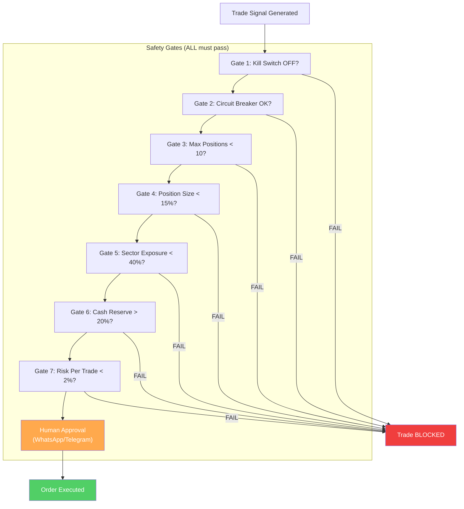

# Business Overview

**Audience**: Business stakeholders, management, and non-technical decision makers.

---

## Executive Summary

The NGX Trading Bot is an autonomous software system that trades stocks on the Nigerian Stock Exchange (NGX) and US equity markets through the Trove/Meritrade brokerage platform. It eliminates the need for manual broker interaction by using browser automation technology to log in, place orders, and manage a portfolio — just as a human trader would, but faster, more disciplined, and available during every second of market hours.

---

## Problem Statement

**Nigerian brokers provide no trading APIs.** Unlike developed markets where algorithmic trading is standard, the NGX ecosystem requires traders to manually log into web portals, navigate dashboards, and click through multi-step order forms. This creates several problems:

- **Speed**: Manual order entry takes minutes. In a 4.5-hour trading window (10:00 AM - 2:30 PM WAT), delays cost money.
- **Discipline**: Human traders deviate from strategy under pressure — chasing losses, holding too long, or overconcentrating in a single stock.
- **Coverage**: A single person cannot monitor 50+ stocks, track news from 6 sources, calculate technical indicators, and execute orders simultaneously.
- **Errors**: Manual data entry leads to wrong quantities, wrong prices, and missed opportunities.

---

## Solution

The NGX Trading Bot acts as an autonomous digital trader:

```mermaid
graph LR
    subgraph SEES["1. SEES"]
        A1["Market Data<br/>(EODHD API)"]
        A2["Financial News<br/>(6 sources)"]
        A3["Broker Portfolio<br/>(Trove dashboard)"]
    end

    subgraph THINKS["2. THINKS"]
        B1["10 Trading<br/>Strategies"]
        B2["Technical<br/>Indicators"]
        B3["AI Analysis<br/>(Claude)"]
    end

    subgraph DECIDES["3. DECIDES"]
        C1["7 Risk Rules"]
        C2["Circuit<br/>Breakers"]
        C3["Kill Switch<br/>Check"]
    end

    subgraph ACTS["4. ACTS"]
        D1["Browser<br/>Automation"]
        D2["Auto-Login<br/>+ OTP"]
        D3["LIMIT Order<br/>Placement"]
    end

    subgraph REPORTS["5. REPORTS"]
        E1["WhatsApp<br/>Alerts"]
        E2["Telegram<br/>Alerts"]
        E3["Approval<br/>Requests"]
    end

    SEES --> THINKS --> DECIDES --> ACTS --> REPORTS
```

1. **Sees** — Collects real-time market data, scrapes financial news from 6 Nigerian and international sources, and reads portfolio positions directly from the broker dashboard.
2. **Thinks** — Runs 10 trading strategies, calculates technical indicators (RSI, MACD, ATR, moving averages), and optionally consults AI (Claude) for news analysis.
3. **Decides** — Applies 7 non-negotiable risk rules before every trade. If any rule fails, the trade is blocked.
4. **Acts** — Automates the entire broker workflow: login, OTP verification, order placement, and confirmation — all through browser automation.
5. **Reports** — Sends real-time alerts via WhatsApp and Telegram for every signal, trade, and risk event.

---

## Key Capabilities

### Autonomous Broker Interaction
- Logs into Trove/Meritrade without human intervention
- Handles OTP (one-time password) verification automatically via Gmail or WhatsApp
- Reads portfolio holdings and cash balances directly from the broker dashboard
- Places LIMIT orders (never market orders, for price protection)

### 10 Trading Strategies
| Strategy | Focus |
|---|---|
| Momentum Breakout | Volume spikes + price breakouts on NGX |
| ETF NAV Arbitrage | Buy ETFs trading below net asset value |
| Dollar-Cost Averaging (DCA) | Monthly systematic buying |
| Dividend Accumulation | High-yield NGX and US stocks |
| Value Accumulation | Fundamentally undervalued NGX stocks |
| Sector Rotation | Rotate into strongest NGX sectors |
| Pension Flow Overlay | Follow pension fund capital flows |
| US Earnings Momentum | Trade post-earnings moves on US stocks |
| US ETF Rotation | Monthly sector ETF rotation (US) |
| Currency Hedge | Gold/USD positions during Naira weakness |

### Real-Time Notifications
- **WhatsApp** (primary): Instant alerts via WAHA integration
- **Telegram** (fallback): Rich-formatted messages with trade details
- **Human-in-the-loop approval**: High-value trades require user confirmation via WhatsApp/Telegram before execution (5-minute timeout, auto-rejects if no response)

### AI-Enhanced Analysis
- Integrates Claude AI for news sentiment analysis
- Automatic deep analysis on earnings releases, M&A, and CBN policy changes
- Budget-controlled: $5/day, $100/month spending limits

### Backtesting Engine
- Tests strategies against 1+ year of real historical data
- Calculates Sharpe ratio, max drawdown, win rate, total return
- Persists results for comparison and optimization

---

## Risk Management

Every trade must pass ALL of these checks — no exceptions:

| Rule | Limit | Purpose |
|---|---|---|
| Max risk per trade | 2% of portfolio | No single trade can cause large losses |
| Max single position | 15% of portfolio (20% for core holdings) | Prevents overconcentration |
| Max sector exposure | 40% of portfolio | Diversification across sectors |
| Min cash reserve | 20% of portfolio | Always maintain liquidity |
| Max open positions | 10 | Manageable position count |
| Min average daily volume | 10,000 shares | Ensures stock is liquid enough to trade |
| Max volume participation | 10% of daily volume | Avoids market impact |

**Circuit Breakers**:
- **5% daily loss**: Halts all trading for the rest of the day
- **10% weekly loss**: Halts all trading until the following Monday

**Kill Switch**: Instant manual override to halt all trading with one command. Sends urgent notification to owner.

### Safety Layers

---

## Market Coverage

### NGX (Nigerian Stock Exchange)
- Large caps: Zenith Bank, GTCO, Access Corp, UBA, Dangote Cement, Seplat, MTNN, and more
- ETFs: Stanbic ETF30, VetGrif30, MerGrowth, MerValue, SiamletETF40, NewGold
- Market hours: 10:00 AM - 2:30 PM WAT, Monday-Friday
- Settlement: T+2 (trade date + 2 business days)
- Daily price limit: +/- 10% from previous close

### US Equities (via Trove)
- ETFs: VOO, SCHD, BND, GLD, VXUS, VNQ
- Individual US stocks tracked for earnings momentum
- Settlement: T+1

---

## Competitive Advantages

1. **First-mover in NGX automation**: No known competitors offer autonomous trading for the Nigerian market.
2. **No API dependency**: Browser automation works regardless of broker API availability — the bot adapts to UI changes through configurable CSS selectors.
3. **AI-enhanced analysis**: Integrates Claude AI for sophisticated news and earnings analysis beyond simple technical indicators.
4. **Settlement-aware cash management**: Separately tracks settled vs. unsettled cash for NGX (T+2) and US (T+1), preventing the bot from spending money it doesn't yet have.
5. **Dual-market support**: Trades both NGX and US equities through a single brokerage platform, enabling currency hedging and geographic diversification.
6. **News intelligence**: Scrapes 6 news sources (BusinessDay, Nairametrics, Reuters, SeekingAlpha, CBN Press, NGX Bulletins) and classifies events by market impact.

---

## Current Status

### Phase 1 — Complete
- Autonomous login and OTP handling (Gmail + WhatsApp)
- 10 trading strategies implemented and configurable
- Full risk management engine with circuit breakers and kill switch
- WhatsApp + Telegram notification system
- AI analysis integration with budget controls
- News scraping from 6 sources with event classification
- Stock discovery pipeline with watchlist management
- DCA scheduling, dividend tracking, portfolio rebalancing
- Backtesting engine with performance analytics
- Dashboard REST API with 14 endpoints
- 30 database migrations, 181+ unit tests, 11 integration test steps

### Phase 2 — Next
- Live order execution (submitOrder wiring)
- Real-time portfolio sync and P&L tracking
- Account verification on Trove platform

### Phase 3 — Future
- Multi-broker support
- Mobile dashboard
- Advanced backtesting with walk-forward optimization

---

## Related Docs
- [Product Spec](./PRODUCT_SPEC.md) — Detailed feature inventory and roadmap
- [Investor Pitch](./PITCH.md) — Pitch deck narrative
- [Developer Guide](./DEVELOPER_GUIDE.md) — Technical architecture (for technical due diligence)
