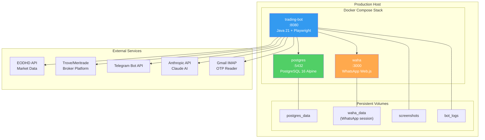
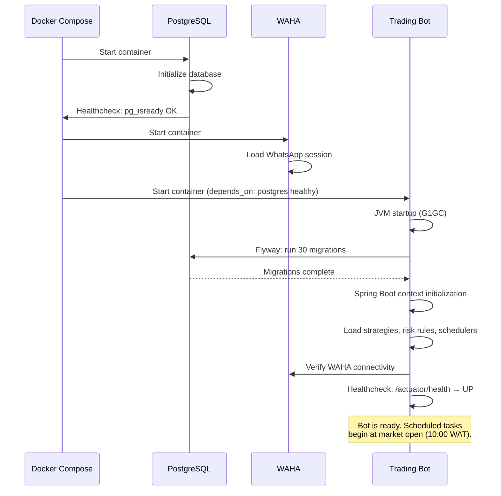

# Deployment Guide

**Audience**: DevOps engineers and system administrators deploying the NGX Trading Bot to production.

---

## Architecture Overview



---

## Prerequisites

| Requirement | Minimum | Recommended |
|---|---|---|
| OS | Ubuntu 22.04 / Debian 12 | Ubuntu 24.04 LTS |
| Docker | 24.0+ | Latest stable |
| Docker Compose | v2.20+ | Latest stable |
| RAM | 4 GB | 8 GB (Playwright + PostgreSQL) |
| Disk | 20 GB | 50 GB (screenshots + logs + DB) |
| CPU | 2 cores | 4 cores |
| Network | Outbound HTTPS (443) | Static IP recommended |

### Required Outbound Access

| Service | Domain | Port |
|---|---|---|
| EODHD Market Data | `eodhd.com` | 443 |
| Trove Broker | `app.trovefinance.com` | 443 |
| Telegram API | `api.telegram.org` | 443 |
| Anthropic API | `api.anthropic.com` | 443 |
| Gmail IMAP | `imap.gmail.com` | 993 |
| WhatsApp Web | `web.whatsapp.com` | 443 |

---

## Environment Configuration

Create a `.env` file in the project root with all required secrets. **Never commit this file to version control.**

```bash
# ===== Database =====
DB_USERNAME=trader
DB_PASSWORD=<strong-password-here>

# ===== Market Data =====
EODHD_API_KEY=<your-eodhd-api-key>

# ===== Broker Credentials =====
MERITRADE_USERNAME=<your-trove-email>
MERITRADE_PASSWORD=<your-trove-password>

# ===== WhatsApp (WAHA) =====
WHATSAPP_CHAT_ID=<phone-number>@c.us
WAHA_API_KEY=<your-waha-api-key>

# ===== Telegram =====
TELEGRAM_BOT_TOKEN=<your-telegram-bot-token>
TELEGRAM_CHAT_ID=<your-telegram-chat-id>

# ===== AI (Optional) =====
AI_ENABLED=true
AI_API_KEY=<your-anthropic-api-key>

# ===== OTP Email (Optional) =====
OTP_EMAIL_ENABLED=false
OTP_EMAIL_USERNAME=<your-gmail-address>
OTP_EMAIL_PASSWORD=<your-gmail-app-password>
```

### Generating Credentials

| Service | How to Get Credentials |
|---|---|
| EODHD | Register at [eodhistoricaldata.com](https://eodhistoricaldata.com), get API key from dashboard |
| Trove | Register at [trovefinance.com](https://trovefinance.com), complete KYC verification |
| Telegram | Message [@BotFather](https://t.me/BotFather) on Telegram, create bot, get token. Get chat ID from [@userinfobot](https://t.me/userinfobot) |
| Anthropic | Register at [console.anthropic.com](https://console.anthropic.com), create API key |
| Gmail App Password | Enable 2FA on Gmail, generate App Password at [myaccount.google.com/apppasswords](https://myaccount.google.com/apppasswords) |

---

## Deployment Steps

### Step 1: Clone and Configure

```bash
git clone <repository-url> trading-bot
cd trading-bot

# Create .env file (see Environment Configuration above)
cp .env.example .env
nano .env
```

### Step 2: Build and Start

```bash
# Build and start all services
docker compose up -d --build

# Verify all three containers are running
docker compose ps
```

Expected output:
```
NAME               STATUS          PORTS
ngx-postgres       Up (healthy)    0.0.0.0:5432->5432/tcp
ngx-waha           Up              0.0.0.0:3000->3000/tcp
ngx-trading-bot    Up              0.0.0.0:8080->8080/tcp
```

### Step 3: Configure WhatsApp (WAHA)

1. Open `http://<host>:3000` in a browser
2. Scan the QR code with your WhatsApp mobile app (Settings > Linked Devices > Link a Device)
3. Wait for the session to establish (status changes to "WORKING")
4. Verify by sending a test message from the bot

> **Important**: The WhatsApp session persists in the `waha_data` volume. If the container is recreated, you may need to re-scan the QR code.

### Step 4: Verify Health

```bash
# Check application health
curl http://localhost:8080/actuator/health

# Expected: {"status":"UP","components":{"db":{"status":"UP"},...}}

# Check Flyway migrations
curl http://localhost:8080/actuator/flyway

# Check WAHA session
curl http://localhost:3000/api/sessions
```

### Step 5: Verify Database

```bash
# Connect to PostgreSQL
docker exec -it ngx-postgres psql -U trader -d ngx_trading

# Check migration count
SELECT COUNT(*) FROM flyway_schema_history WHERE success = true;
-- Expected: 30

# Check seed data
SELECT COUNT(*) FROM watchlist_stocks;
-- Expected: > 0

# Exit
\q
```

---

## Docker Compose Services

### trading-bot

| Setting | Value | Notes |
|---|---|---|
| Base image | `mcr.microsoft.com/playwright/java:v1.41.0-jammy` | Includes Chromium for browser automation |
| JDK | Eclipse Temurin 21 | Installed in Dockerfile |
| Port | 8080 | REST API + Actuator |
| Spring Profile | `prod` | Set via `SPRING_PROFILES_ACTIVE` |
| JVM flags | G1GC, heap dump on OOM | Configured in Dockerfile ENTRYPOINT |
| Runs as | `trader` (non-root) | Security best practice |
| Health check | `curl /actuator/health` | Every 30s, 10s timeout, 3 retries |

### postgres

| Setting | Value |
|---|---|
| Image | `postgres:16-alpine` |
| Database | `ngx_trading` |
| Health check | `pg_isready` every 10s |
| Volume | `postgres_data` at `/var/lib/postgresql/data` |

### waha

| Setting | Value |
|---|---|
| Image | `devlikeapro/waha:latest` |
| Engine | WEBJS |
| Port | 3000 |
| Volume | `waha_data` at `/app/.sessions` |

---

## Production Configuration

The `prod` profile (`application-prod.yml`) applies these overrides:

| Setting | Dev Value | Prod Value | Why |
|---|---|---|---|
| `meritrade.headless` | `true` | `true` | No GUI in production |
| `meritrade.slow-mo-ms` | `500` | `300` | Faster automation in production |
| `meritrade.screenshot-dir` | `./screenshots` | `/app/screenshots` | Docker volume mount |
| `meritrade.session-max-hours` | `5` | `4` | Tighter session control |
| `meritrade.screenshot-retention-hours` | `72` | `48` | Less disk usage |
| `spring.datasource.hikari.maximum-pool-size` | `10` | `15` | Handle concurrent load |
| `server.shutdown` | (default) | `graceful` | Clean shutdown |
| `logging.file.name` | (console) | `/app/logs/trading-bot.log` | File logging with rotation |
| `logging.logback.rollingpolicy.max-file-size` | (default) | `50MB` | Prevents log bloat |
| `logging.logback.rollingpolicy.max-history` | (default) | `30` | 30-day log retention |

---

## Monitoring

### Health Checks

```bash
# Application health (includes DB, disk, ping)
curl -s http://localhost:8080/actuator/health | jq .

# Detailed component status
curl -s http://localhost:8080/actuator/health | jq '.components'

# Flyway migration status
curl -s http://localhost:8080/actuator/flyway | jq .

# Spring Boot metrics
curl -s http://localhost:8080/actuator/metrics | jq '.names[]'
```

### Log Monitoring

```bash
# Follow bot logs
docker logs -f ngx-trading-bot

# Follow with timestamps
docker logs -f --timestamps ngx-trading-bot

# View logs from Docker volume
docker exec ngx-trading-bot tail -100 /app/logs/trading-bot.log

# Search for errors
docker logs ngx-trading-bot 2>&1 | grep -i error

# Search for kill switch events
docker logs ngx-trading-bot 2>&1 | grep -i "kill.switch"
```

### Key Log Patterns to Monitor

| Pattern | Meaning | Severity |
|---|---|---|
| `KillSwitch ACTIVATED` | Trading halted | CRITICAL |
| `Circuit breaker tripped` | Daily/weekly loss limit hit | HIGH |
| `Order status: UNCERTAIN` | Order execution failed | HIGH |
| `OTP timeout` | OTP not received in time | MEDIUM |
| `Budget exceeded` | AI spending limit reached | LOW |
| `Scraper failed` | News source unreachable | LOW |

### Monitoring Dashboard Queries

```bash
# Portfolio value
curl -s http://localhost:8080/api/portfolio | jq '.totalValueNgn'

# Kill switch status
curl -s http://localhost:8080/api/killswitch | jq '.'

# AI budget status
curl -s http://localhost:8080/api/ai/cost | jq '.'

# Open positions count
curl -s http://localhost:8080/api/portfolio | jq '.openPositions'
```

---

## Backup & Recovery

### Database Backup

```bash
# Create a backup
docker exec ngx-postgres pg_dump -U trader -d ngx_trading > backup_$(date +%Y%m%d_%H%M%S).sql

# Create a compressed backup
docker exec ngx-postgres pg_dump -U trader -d ngx_trading | gzip > backup_$(date +%Y%m%d).sql.gz
```

### Automated Daily Backup (Cron)

```bash
# Add to crontab (crontab -e)
0 3 * * * docker exec ngx-postgres pg_dump -U trader -d ngx_trading | gzip > /backups/ngx_trading_$(date +\%Y\%m\%d).sql.gz 2>&1
# Retain 30 days
0 4 * * * find /backups -name "ngx_trading_*.sql.gz" -mtime +30 -delete
```

### Database Restore

```bash
# Stop the trading bot first
docker compose stop trading-bot

# Restore from backup
cat backup_20260223.sql | docker exec -i ngx-postgres psql -U trader -d ngx_trading

# Restart
docker compose start trading-bot
```

### Volume Backup

```bash
# Backup all Docker volumes
docker run --rm -v postgres_data:/data -v $(pwd):/backup alpine tar czf /backup/postgres_data.tar.gz -C /data .
docker run --rm -v waha_data:/data -v $(pwd):/backup alpine tar czf /backup/waha_data.tar.gz -C /data .
```

---

## Maintenance

### Updating the Application

```bash
# Pull latest code
git pull origin main

# Rebuild and restart (zero-downtime not supported — bot has no clustering)
docker compose up -d --build trading-bot

# Verify
curl -s http://localhost:8080/actuator/health | jq '.status'
```

> **Note**: Flyway migrations run automatically on startup. New migrations will be applied when the updated container starts.

### Updating WAHA

```bash
# Pull latest WAHA image
docker compose pull waha

# Restart WAHA (may require QR re-scan)
docker compose up -d waha

# Verify session
curl -s http://localhost:3000/api/sessions
```

### Screenshot Cleanup

Screenshots are automatically cleaned up by the bot based on `meritrade.screenshot-retention-hours` (48h in prod). To manually clean:

```bash
# View screenshot volume
docker exec ngx-trading-bot ls -la /app/screenshots/

# Manual cleanup (older than 2 days)
docker exec ngx-trading-bot find /app/screenshots -name "*.png" -mtime +2 -delete
```

### Database Maintenance

```bash
# Analyze tables for query optimization
docker exec ngx-postgres psql -U trader -d ngx_trading -c "ANALYZE;"

# Check table sizes
docker exec ngx-postgres psql -U trader -d ngx_trading -c "
  SELECT relname AS table, pg_size_pretty(pg_total_relation_size(relid)) AS size
  FROM pg_catalog.pg_statio_user_tables
  ORDER BY pg_total_relation_size(relid) DESC
  LIMIT 10;
"
```

---

## Troubleshooting

### Bot Won't Start

```bash
# Check container logs
docker logs ngx-trading-bot

# Common causes:
# 1. PostgreSQL not ready → check depends_on and healthcheck
# 2. Missing .env variables → check docker compose config
# 3. Flyway migration failure → check migration SQL files
# 4. Port 8080 in use → check with: lsof -i :8080
```

### WhatsApp Not Working

```bash
# Check WAHA session status
curl -s http://localhost:3000/api/sessions | jq .

# If session expired, restart and re-scan QR
docker compose restart waha
# Open http://<host>:3000 and scan QR code

# Verify webhook is reachable from WAHA
docker exec ngx-waha curl -s http://trading-bot:8080/actuator/health
```

### OTP Failures

```bash
# Check OTP handler logs
docker logs ngx-trading-bot 2>&1 | grep -i otp

# Common causes:
# 1. Gmail App Password expired → regenerate at myaccount.google.com
# 2. WAHA session disconnected → re-scan QR code
# 3. OTP email delayed → check spam folder, increase max-wait-seconds
```

### Database Connection Issues

```bash
# Check PostgreSQL is running
docker exec ngx-postgres pg_isready -U trader -d ngx_trading

# Check connection from bot container
docker exec ngx-trading-bot curl -s http://localhost:8080/actuator/health | jq '.components.db'

# Check connection pool metrics
curl -s http://localhost:8080/actuator/metrics/hikaricp.connections.active | jq .
```

### Emergency Kill Switch

```bash
# Activate kill switch immediately
curl -X POST http://localhost:8080/api/killswitch/activate \
  -H "Content-Type: application/json" \
  -d '{"reason": "Emergency manual halt"}'

# Verify it's active
curl -s http://localhost:8080/api/killswitch | jq .

# Deactivate when ready
curl -X POST http://localhost:8080/api/killswitch/deactivate
```

---

## Security Checklist

- [ ] `.env` file has restricted permissions (`chmod 600 .env`)
- [ ] `.env` is in `.gitignore` (never committed)
- [ ] PostgreSQL password is strong and unique
- [ ] WAHA API key is set (not using default)
- [ ] Bot runs as non-root user (`trader`) inside container
- [ ] Ports 5432 and 3000 are NOT exposed to the public internet
- [ ] Port 8080 is restricted to trusted networks (or behind a reverse proxy)
- [ ] Gmail uses App Password (not main account password)
- [ ] Telegram bot token is not shared publicly
- [ ] Regular database backups are configured and tested
- [ ] Log files do not contain credentials (verify with `grep -r "password" /app/logs/`)

---

## Startup Sequence



---

## Related Docs
- [Developer Guide](./DEVELOPER_GUIDE.md) — Local development setup
- [API Reference](./API_REFERENCE.md) — REST API documentation
- [QA Guide](./QA_GUIDE.md) — Testing and validation
