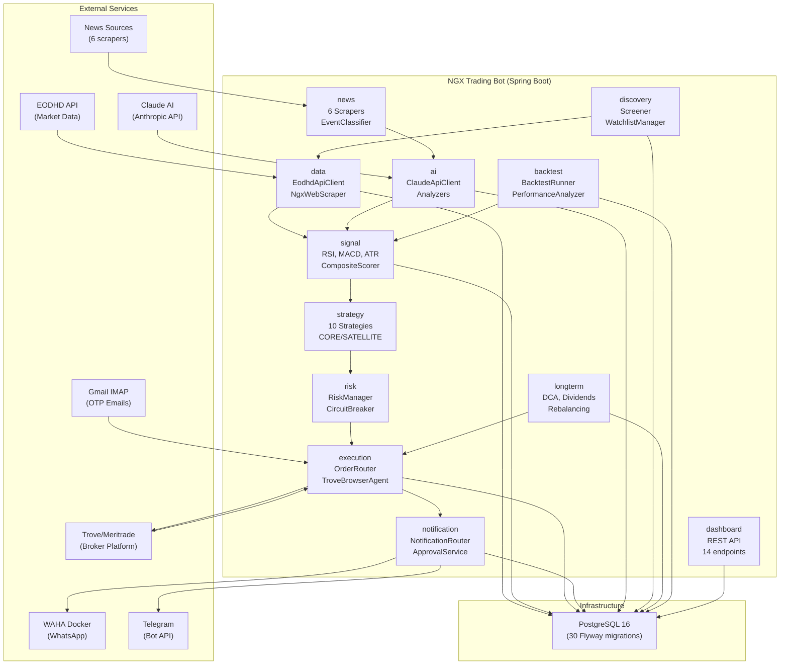
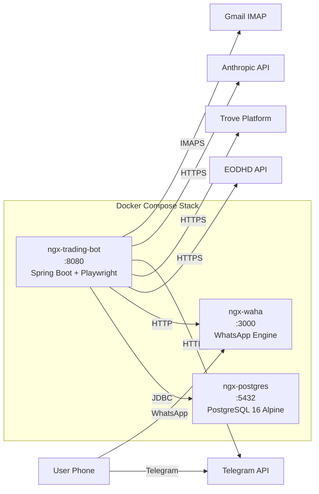
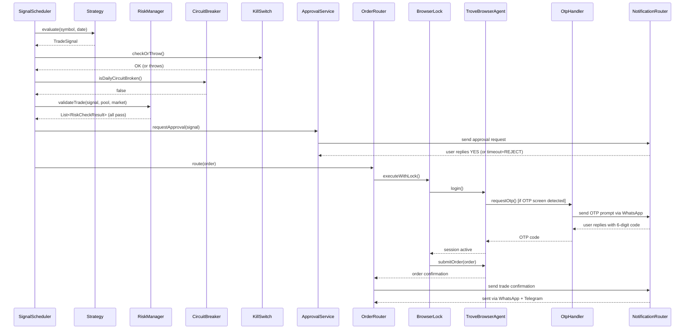
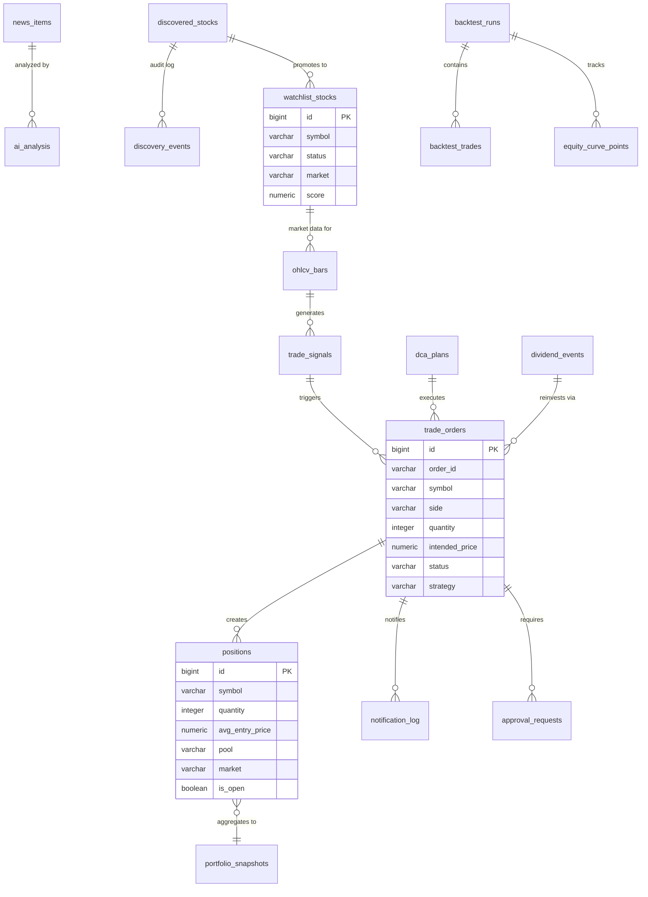

# Developer Guide

**Audience**: Software engineers onboarding to or contributing to the NGX Trading Bot.

---

## Architecture Overview

The NGX Trading Bot is a Spring Boot 3.3 application (Java 17) that autonomously trades equities on the Nigerian Stock Exchange (NGX) and US markets via the Trove/Meritrade brokerage platform. Since Nigerian brokers offer no APIs, all order execution happens through Playwright-Java browser automation.

### System Architecture Diagram



### Deployment Architecture



### Trade Execution Sequence



### High-Level Pipeline

```
Market Data (EODHD + Scrapers)
       |
  Signal Generation (Technical + Fundamental Indicators)
       |
  Strategy Evaluation (10 strategies, CORE/SATELLITE pools)
       |
  Risk Validation (7 hard rules + circuit breakers)
       |
  Trade Approval (WhatsApp/Telegram human-in-the-loop)
       |
  Order Execution (Playwright browser automation on Trove)
       |
  Notifications (WhatsApp via WAHA + Telegram)
```

---

## Module Breakdown

### `common` — Shared Models & Exceptions
- **Models**: `TradeSide`, `SignalStrength`, `Market`, `Currency`, `PortfolioPool`, `WatchlistStatus`, `ApprovalStatus`, `ApprovalMethod`, `EventType`, `ExitReason`, `ExecutionMethod`, `DataSource`, `CorporateActionType`
- **Exceptions**: `KillSwitchActiveException`, `BrokerSessionException`, `InsufficientLiquidityException`, `RiskLimitExceededException`
- **Utilities**: `MarketHoursUtil` (10:00-14:30 WAT enforcement), `NgnFormatUtil` (Naira currency formatting)

### `data` — Market Data Ingestion
- `EodhdApiClient` — Fetches OHLCV bars, fundamentals from EODHD API (ticker format: `SYMBOL.XNSA`)
- `EtfNavScraper` — Scrapes ETF NAV values
- `NgxWebScraper` — Scrapes NGX daily price list and ASI index
- `NewsRssScraper` — RSS feed parsing
- **Entities**: `OhlcvBar`, `EtfValuation`, `MarketIndex`, `NewsItem`, `WatchlistStock`, `CorporateAction`
- **Scheduler**: `DataCollectionScheduler` — Cron-driven data fetch during market hours

### `signal` — Signal Generation
- `TechnicalIndicatorService` — Orchestrates indicator calculation
- **Technical**: `RsiCalculator`, `MacdCalculator`, `MovingAverageCalculator`, `AtrCalculator`, `VolumeAnalyzer`
- **Fundamental**: `NavDiscountCalculator`, `DividendProximityScanner`, `PencomEligibilityChecker`
- `CompositeSignalScorer` — Weights multiple indicators into final signal score
- `SignalGenerationScheduler` — Triggers signal generation during market hours
- **Model**: `TradeSignal` (symbol, side, price, stopLoss, target, confidence, strategy)

### `strategy` — Trading Strategies
10 strategies implementing the `Strategy` interface:

| Strategy | Pool | Market | Description |
|---|---|---|---|
| `MomentumBreakoutStrategy` | SATELLITE | NGX | Volume spikes + SMA breakouts |
| `EtfNavArbitrageStrategy` | SATELLITE | NGX | ETF NAV discount/premium |
| `DcaStrategy` | CORE | BOTH | Dollar-cost averaging on schedule |
| `DividendAccumulationStrategy` | CORE | BOTH | High-yield dividend stocks |
| `ValueAccumulationStrategy` | CORE | NGX | Fundamental value screening |
| `SectorRotationStrategy` | SATELLITE | NGX | Rotate into strong sectors |
| `PensionFlowOverlay` | SATELLITE | NGX | Follow pension fund flows |
| `UsEarningsMomentumStrategy` | SATELLITE | US | Post-earnings price moves |
| `UsEtfRotationStrategy` | SATELLITE | US | Sector ETF rotation |
| `CurrencyHedgeStrategy` | CORE | BOTH | Gold/USD hedge on Naira weakness |

Each strategy supports `StrategyPool` (CORE/SATELLITE) and `StrategyMarket` (NGX/US/BOTH). All are enable/disable configurable via YAML.

### `risk` — Risk Management
- `RiskManager` — Central risk orchestrator running 5 pre-trade checks:
  1. Max open positions (default: 10)
  2. Single position size (15% SATELLITE, 20% CORE)
  3. Sector exposure (max 40%)
  4. Cash reserve (min 20%)
  5. Risk per trade (max 2%)
- `CircuitBreaker` — Halts trading on 5% daily loss or 10% weekly loss
- `SettlementCashTracker` — Tracks settled vs. unsettled cash (T+2 NGX, T+1 US)
- `PositionSizer` — Calculates optimal position size given risk constraints
- `StopLossMonitor` — Monitors open positions against stop-loss levels
- `CurrencyExposureChecker`, `GeographicExposureChecker` — Cross-market exposure checks

### `execution` — Order Execution
- `OrderRouter` — Routes signals through risk checks to broker gateway
- `TroveBrowserAgent` — Playwright-based browser automation for Trove platform (login, navigate, submit orders, scrape portfolio)
- `BrokerGateway` — Abstraction layer over browser agent
- `OtpHandler` — Handles OTP prompts via WhatsApp reply or Gmail IMAP
- `EmailOtpReader` — Reads OTP codes from Gmail via IMAP
- `KillSwitchService` — Emergency halt of all trading (idempotent activation, notification on first trigger)
- `BrowserSessionLock` — Serializes concurrent browser operations
- `OrderRecoveryService` — Handles execution failures (marks orders UNCERTAIN, activates kill switch)
- `PortfolioReconciler`, `CashReconciler`, `FxRateReconciler` — Sync broker state to DB
- `TroveApiClient` — HTTP client for any Trove API endpoints

### `notification` — Alerts & Approvals
- `NotificationRouter` — Sends to WhatsApp (primary) and Telegram (fallback)
- `WhatsAppService` — Sends messages via WAHA Docker container
- `TelegramService` — Sends messages via Telegram Bot API
- `MessageFormatter` — Formats trade signals, alerts, portfolio summaries
- `TradeApprovalService` — Human-in-the-loop approval flow (5-min timeout, default REJECT)
- `WhatsAppWebhookController` — Receives webhook POSTs from WAHA for OTP/approval replies

### `discovery` — Stock Screening & Watchlist
- `EodhdScreenerClient` — Screens NGX stocks via EODHD screener API
- `WatchlistManager` — Manages active watchlist (max 30 stocks)
- `CandidateEvaluator` — Scores discovered stocks on fundamentals
- `PromotionPolicy` / `DemotionPolicy` — Rules for promoting/demoting between observation and active watchlist
- `NewsDiscoveryListener` — Discovers stocks mentioned in news
- `DiscoveryScheduler` — Periodic screening runs

### `longterm` — DCA, Dividends & Rebalancing
- `DcaExecutor` — Executes monthly DCA buys (NGX day 5, US day 10)
- `DividendTracker` — Tracks ex-dates, alerts 7 days before
- `DividendReinvestmentService` — Auto-reinvest dividends
- `PortfolioRebalancer` — Quarterly rebalancing with drift threshold (10%)
- `CorePortfolioManager` — Manages core portfolio target allocations
- `TargetAllocationService` — Calculates target vs. actual allocation drift
- `FundamentalScreener` — Screens stocks on fundamental metrics
- **Schedulers**: `DcaScheduler`, `DividendCheckScheduler`, `RebalanceScheduler`, `FundamentalUpdateScheduler`

### `ai` — Claude API Integration
- `ClaudeApiClient` — Sends prompts to Anthropic API (default: claude-haiku-4-5, deep analysis: claude-sonnet-4-6)
- `AiCostTracker` — Tracks daily/monthly API spend against budget ($5/day, $100/month)
- `AiFallbackHandler` — Graceful degradation when AI is unavailable or budget exceeded
- **Analyzers**: `AiNewsAnalyzer`, `AiEarningsAnalyzer`, `AiInsiderTradeInterpreter`, `AiCrossArticleSynthesizer`
- **Entities**: `AiAnalysis`, `AiCostLedger`
- `AiAnalysisScheduler` — Triggers analysis on configured events (earnings, M&A, CBN policy)

### `news` — News Scraping & Classification
- **Scrapers**: `BusinessDayScraper`, `NairametricsScraper`, `SeekingAlphaScraper`, `ReutersRssScraper`, `CbnPressScraper`, `NgxBulletinParser`
- `NewsEventClassifier` — Classifies news into event types
- `InsiderTradeDetector` — Detects insider trading mentions
- `EventImpactRules` — Maps event types to expected market impact
- `NewsImpactScorer` — Scores news items by impact severity
- `NewsScraperScheduler` — Periodic scraping runs

### `backtest` — Strategy Backtesting
- `BacktestRunner` — Runs strategies against historical OHLCV data
- `SimulatedOrderExecutor` — Simulates order fills with slippage
- `PerformanceAnalyzer` — Calculates Sharpe ratio, max drawdown, win rate, total return
- `BacktestController` — REST API for triggering and viewing backtests
- **Entities**: `BacktestRun`, `BacktestTrade`, `EquityCurvePoint`

### `dashboard` — REST API
- `DashboardController` — Portfolio overview, FX rates, settlement status, kill switch, dividends
- `SignalController` — Today's signals, recent news, AI cost summary
- `PerformanceController` — Performance metrics
- `DiscoveryController` — Active discoveries, candidates

### `config` — Configuration
- `PlaywrightConfig` — Browser launch settings
- `AppConfig` — General app beans, WebClient setup
- `WebClientConfig` — WebClient bean configuration
- `SchedulingConfig` — Enables `@Scheduled` support
- **Properties**: `EodhdProperties`, `MeritradeProperties`, `RiskProperties`, `NotificationProperties`, `TradingProperties`, `StrategyProperties`, `AiProperties`, `DiscoveryProperties`, `LongtermProperties`

---

## Local Setup

### Prerequisites
- Java 17+ (JDK)
- Maven 3.9+
- PostgreSQL 16 (via Docker or local install)
- Docker & Docker Compose (for PostgreSQL, WAHA)
- Playwright browsers: `mvn exec:java -e -D exec.mainClass=com.microsoft.playwright.CLI -D exec.args="install"`

### Environment Variables
Create a `.env` file at the project root (never commit this):

```env
DB_USERNAME=trader
DB_PASSWORD=changeme
EODHD_API_KEY=your_eodhd_key
MERITRADE_USERNAME=your_email
MERITRADE_PASSWORD=your_password
OTP_EMAIL_ENABLED=true
OTP_EMAIL_USERNAME=your_gmail
OTP_EMAIL_PASSWORD=your_gmail_app_password
WHATSAPP_CHAT_ID=234XXXXXXXXXX@c.us
WAHA_API_KEY=ngx-waha-local-key
TELEGRAM_BOT_TOKEN=your_bot_token
TELEGRAM_CHAT_ID=your_chat_id
AI_ENABLED=false
AI_API_KEY=your_anthropic_key
```

### Start Infrastructure
```bash
docker compose up -d          # PostgreSQL + WAHA
```

### Run the Application
```bash
mvn clean compile
mvn spring-boot:run           # Default profile
mvn spring-boot:run -Dspring-boot.run.profiles=dev  # Dev profile
```

### Full Docker Stack
```bash
docker compose up -d          # Bot + PostgreSQL + WAHA
```

---

## Database

### Flyway Migrations
30 migrations in `src/main/resources/db/migration/` (V1 through V30):

| Migration | Table(s) Created |
|---|---|
| V1 | `ohlcv_bars` |
| V2 | `etf_valuations` |
| V3 | `trade_orders` |
| V4 | `positions` |
| V5 | `portfolio_snapshots` |
| V6 | `corporate_actions` |
| V7 | `market_indices` |
| V8 | `watchlist_stocks` |
| V9 | `trade_signals` |
| V10 | `notification_log` |
| V11 | `kill_switch_state` |
| V12 | `approval_requests` |
| V13 | `news_items` |
| V14 | `broker_sessions` |
| V15 | `risk_events` |
| V16 | `circuit_breaker_log` |
| V17 | `sector_mapping` |
| V18 | `system_config` |
| V19 | `updated_at` triggers |
| V20 | Seed watchlist stocks |
| V21 | `ai_analysis`, `ai_cost_ledger` |
| V22 | News event columns |
| V23 | `discovered_stocks` |
| V24 | `discovery_events` |
| V25 | `core_holdings` |
| V26 | `dca_plans` |
| V27 | `dividend_events` |
| V28 | `rebalance_actions` |
| V29 | Pool/market/currency columns on positions |
| V30 | `backtest_runs`, `backtest_trades`, `equity_curve_points` |

Hibernate runs in `validate` mode — schema changes must go through Flyway.

### Entity Relationship Diagram (Key Tables)



---

## Configuration Guide

All configuration lives in `src/main/resources/application.yml` with profile overrides:
- `application-prod.yml` — Production (Docker, tighter timeouts, file logging)
- `application-integration.yml` — Integration tests (debug logging, all strategies disabled)

### Key Sections

```yaml
trading:          # Market hours, timezone, watchlist symbols
risk:             # All 7 risk thresholds (percentages)
meritrade:        # Broker URL, credentials, CSS selectors for Playwright
otp:              # Gmail IMAP settings for OTP reading
notification:     # WhatsApp (WAHA) + Telegram config
ai:               # Claude API, model selection, budget limits
discovery:        # Screener thresholds, watchlist sizing
longterm:         # DCA budgets, dividend reinvestment, rebalance rules
strategies:       # Per-strategy enable/disable + parameters
```

### CSS Selector Customization
If the Trove UI changes, update selectors under `meritrade.selectors` in `application.yml`. Key selectors:
- `login-username`, `login-password`, `login-submit`
- `otp-input`, `otp-submit`
- `portfolio-rows`, `portfolio-symbol`, `portfolio-quantity`
- `trade-symbol`, `trade-quantity`, `trade-price`, `trade-review`, `trade-confirm`

---

## Coding Conventions

| Rule | Convention |
|---|---|
| Monetary values | `BigDecimal` — never `double` or `float` |
| Trade dates | `LocalDate` |
| Timestamps | `ZonedDateTime` with `ZoneId.of("Africa/Lagos")` |
| Dependency injection | Constructor injection only (no field `@Autowired`) |
| Scheduled tasks | `zone = "Africa/Lagos"` on all `@Scheduled` |
| Orders | LIMIT only — never market orders |
| Percentages | Stored as decimals in config (2.0 = 2%), compared as `BigDecimal` |
| Boilerplate | Lombok (`@RequiredArgsConstructor`, `@Slf4j`, `@Builder`, `@Data`) |
| Null safety | Entities use Optional returns from repositories |

---

## Testing

### Unit Tests
~181 test methods across 24 test classes. Run with:
```bash
mvn test                      # Excludes integration tests by default
```

Key test classes:
- `RiskManagerTest` — All 5 risk check scenarios
- `CircuitBreakerTest` — Daily/weekly loss triggers
- `SettlementCashTrackerTest` — T+2 NGX, T+1 US settlement
- `OrderRouterTest` — Order routing logic
- `EndToEndFlowTest` — Kill switch, OTP, browser lock, order recovery, cross-market
- `MomentumBreakoutStrategyTest`, `EtfNavArbitrageStrategyTest` — Strategy evaluation
- `MessageFormatterTest`, `TradeApprovalServiceTest` — Notification formatting
- `RsiCalculatorTest`, `MacdCalculatorTest`, `NavDiscountCalculatorTest` — Indicator math
- `EventImpactRulesTest`, `NewsEventClassifierTest` — News classification
- `DcaExecutorTest`, `DividendTrackerTest`, `PortfolioRebalancerTest` — Long-term modules
- `PerformanceAnalyzerTest`, `SimulatedOrderExecutorTest` — Backtest modules
- `WatchlistManagerTest` — Discovery module
- `EodhdApiClientTest` — Data client

### Integration Tests
11 step files (`Step01_*IT.java` through `Step11_*IT.java`), tagged with `@Tag("integration")`. Run with:
```bash
mvn verify -Pintegration      # Uses Maven Failsafe plugin
```

Requires real PostgreSQL, EODHD API key, WAHA, Telegram bot, and optionally Meritrade credentials.

---

## Common Commands

```bash
mvn clean compile                              # Build
mvn test                                       # Unit tests only
mvn verify -Pintegration                       # Integration tests
mvn spring-boot:run                            # Run locally
mvn spring-boot:run -Dspring-boot.run.profiles=dev  # Dev profile
docker compose up -d                           # Full stack
docker compose up -d postgres waha             # Infrastructure only
docker compose logs -f trading-bot             # Follow bot logs
```

---

## Related Docs
- [API Reference](./API_REFERENCE.md) — REST API documentation with request/response examples
- [Deployment Guide](./DEPLOYMENT_GUIDE.md) — Production deployment, Docker, monitoring, backups
- [QA Guide](./QA_GUIDE.md) — Test architecture, integration test details, manual testing
- [Product Spec](./PRODUCT_SPEC.md) — Feature inventory and roadmap
- [Business Overview](./BUSINESS_OVERVIEW.md) — Non-technical overview for stakeholders
