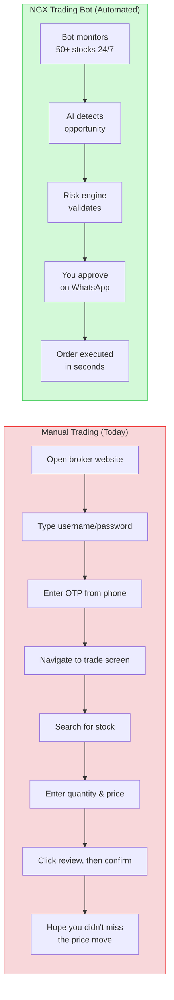

# NGX Trading Bot — Investor Pitch

---

## The Problem

Nigeria's stock market (NGX) has a market capitalization of over $50 billion and is one of Africa's largest exchanges. Yet retail investors face a frustrating reality:

- **Zero API access** — Nigerian brokers offer no programmatic trading APIs. Every order must be placed manually through a web portal.
- **4.5-hour trading window** — The NGX is open from 10:00 AM to 2:30 PM (WAT), one of the shortest trading windows globally. Miss a signal, miss the opportunity.
- **Manual, error-prone execution** — Logging in, navigating dashboards, entering order details, handling OTP verification — each trade requires 10+ manual steps.
- **No automation tools exist** — While developed markets have dozens of algorithmic trading platforms, the Nigerian market has none.
- **Growing retail participation** — NGX retail investor accounts have been growing year over year, but the tools available to them remain primitive.

The result: Nigerian investors are systematically disadvantaged compared to institutional players and investors in more developed markets.

---

## The Solution

### Manual Trading vs. NGX Trading Bot



**An AI-powered autonomous trading bot that sees, thinks, and acts like a human trader — but faster, more disciplined, and never misses market hours.**

The NGX Trading Bot is a software system that:
- **Logs into your brokerage account** automatically (including OTP verification)
- **Analyzes market data** from multiple sources in real-time
- **Generates trade signals** using 10 proven strategies
- **Enforces strict risk rules** before every single trade
- **Executes orders** through browser automation — the same way a human would
- **Reports everything** to your phone via WhatsApp and Telegram

---

## How It Works

```
  [1] DATA              [2] ANALYSIS           [3] DECISION
  EODHD Market Data     RSI, MACD, ATR         10 Strategies
  6 News Sources        AI Sentiment           Signal Scoring
  Broker Portfolio      Fundamental Screens    Risk Validation
       |                     |                      |
       +---------------------+----------------------+
                             |
                        [4] EXECUTION
                  Browser Automation (Playwright)
                  Auto-Login + Auto-OTP
                  LIMIT Orders Only
                             |
                        [5] ALERT
                  WhatsApp + Telegram
                  Human Approval for Big Trades
                  Real-Time Portfolio Updates
```

---

## Market Opportunity

- **NGX market cap**: ~$50B+ with growing daily trading volumes
- **Retail investor growth**: Increasing year-over-year, driven by fintech awareness and platforms like Trove
- **Automation gap**: Zero existing solutions for automated NGX trading
- **Dual-market access**: Trove enables trading both NGX and US equities from a single platform, expanding the addressable market
- **Emerging market alpha**: Less efficient markets offer greater opportunities for systematic trading strategies
- **Regulatory tailwind**: NGX is actively modernizing its infrastructure and encouraging technology adoption

---

## Technology Moat

### 1. Browser Automation Bypasses API Absence
Where others see a blocker (no APIs), we see a solved problem. Our Playwright-based browser automation mimics human interaction with the broker platform, working with any broker UI regardless of API availability.

### 2. Zero-Touch OTP Handling
Our bot reads OTP codes from Gmail (IMAP) and WhatsApp (WAHA), entering them automatically. This is the key enabler for truly autonomous operation — no human needs to be present to verify login.

### 3. AI-Enhanced Signal Analysis
Claude AI analyzes news from 6 sources, interprets earnings reports, and detects insider trading patterns. The system automatically escalates to deeper analysis models for high-impact events (earnings releases, CBN policy changes, M&A).

### 4. Settlement-Aware Cash Management
The system independently tracks settled vs. unsettled cash across both markets (T+2 for NGX, T+1 for US), preventing the bot from spending money that hasn't settled — a nuance most retail traders ignore.

### 5. Configurable Without Code Changes
Every trading strategy, risk parameter, and UI selector is configurable via YAML. When a broker updates their web UI, we update a config file — no code deployment needed.

---

## Traction

**Working prototype with proven infrastructure:**

- Autonomous login + OTP handling (Gmail + WhatsApp)
- 10 trading strategies implemented and tested
- 7-rule risk management engine with circuit breakers
- Real-time WhatsApp and Telegram notifications
- AI analysis integration with budget controls
- News intelligence from 6 sources
- Backtesting engine with historical data
- Dashboard REST API (14 endpoints)
- **181+ unit tests** passing
- **11 integration test steps** validating the full pipeline
- **30 database migrations** for a production-ready schema
- Dual-market support: NGX and US equities

---

## Revenue Model

| Model | Description | Target |
|---|---|---|
| **SaaS Subscription** | Monthly/annual access to the trading bot platform | Retail investors, HNWIs |
| **Performance Fees** | Percentage of profits generated above a benchmark | Managed account clients |
| **White-Label** | Licensed to Nigerian brokerages as a value-add for their clients | Meristem, Stanbic IBTC, CSCS participants |
| **Data & Analytics** | NGX market intelligence, sentiment data, and signal feeds | Institutional investors, asset managers |

---

## Team

> *[Placeholder — Add team member bios, relevant experience, and LinkedIn profiles here]*
>
> - **Founder/CEO**: [Name] — [Background]
> - **CTO**: [Name] — [Background]
> - **Quantitative Analyst**: [Name] — [Background]

---

## The Ask

> *[Placeholder — Customize based on your fundraising stage and needs]*
>
> We are raising **$[amount]** in **[seed/pre-seed/Series A]** funding to:
>
> 1. Complete live trading integration and deploy to production
> 2. Onboard first 100 beta users with managed accounts
> 3. Build mobile dashboard for portfolio monitoring
> 4. Expand to additional Nigerian brokerages
> 5. Hire quantitative analyst and full-stack engineer
>
> **Use of funds**:
> - [X]% Engineering & Product
> - [X]% Operations & Infrastructure
> - [X]% Marketing & User Acquisition
> - [X]% Regulatory & Compliance

---

## Contact

> *[Placeholder — Add contact information]*
>
> - **Email**: [your@email.com]
> - **Phone**: [+234 XXX XXX XXXX]
> - **Website**: [yourwebsite.com]
> - **GitHub**: [repository link]

---

## Related Docs
- [Business Overview](./BUSINESS_OVERVIEW.md) — Detailed business context
- [Product Spec](./PRODUCT_SPEC.md) — Full feature inventory and roadmap
- [Developer Guide](./DEVELOPER_GUIDE.md) — Technical architecture (for technical due diligence)
