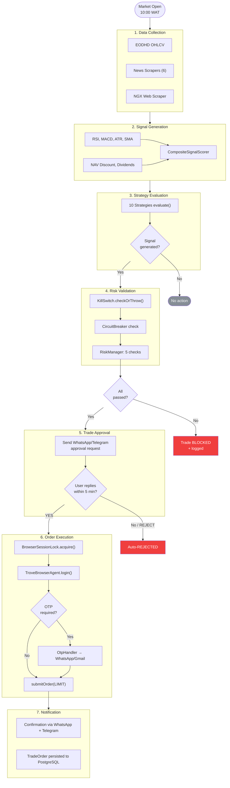
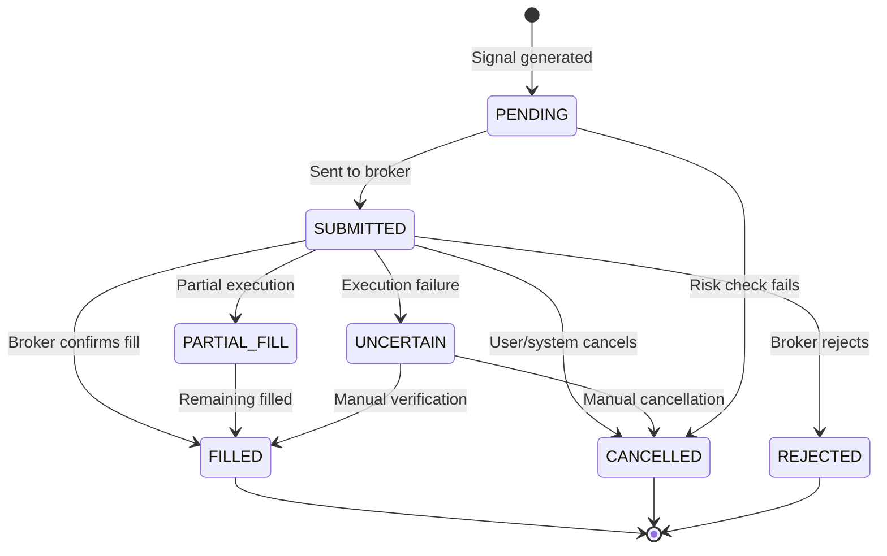
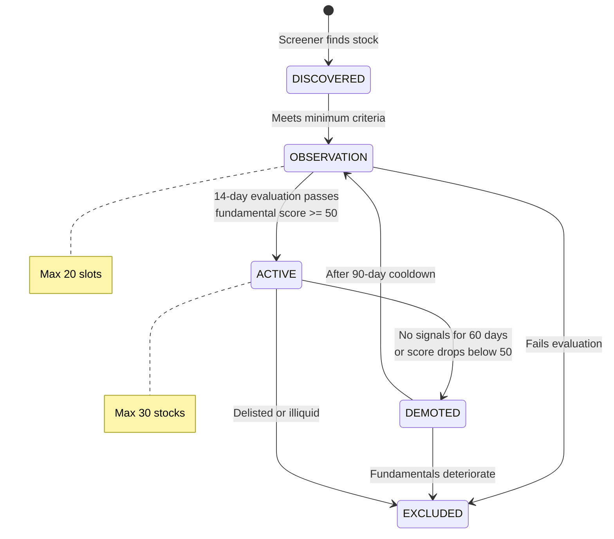
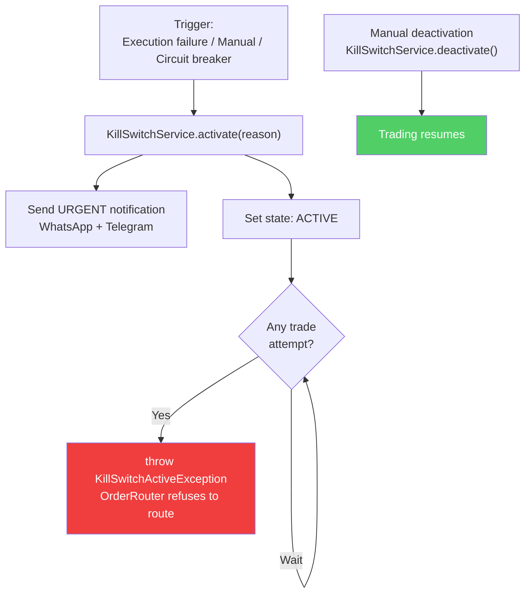
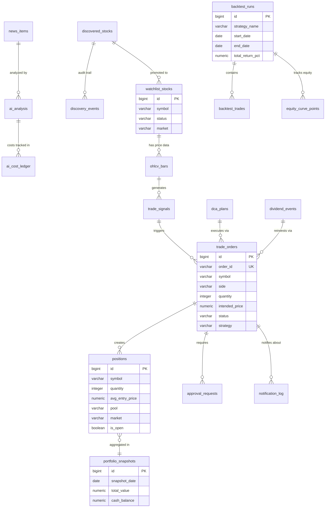

# Product Specification

**Audience**: Product managers, designers, and project planners.

---

## Product Vision

A fully autonomous trading system for emerging market equities, starting with the Nigerian Stock Exchange (NGX) and expanding to US equities via Trove's dual-market platform. The system replaces manual broker interaction with intelligent automation — analyzing data, generating signals, managing risk, executing trades, and reporting results with zero human intervention during normal operation.

---

## Feature Inventory

### Core Trading Engine

| Feature | Status | Description |
|---|---|---|
| Signal generation pipeline | Done | Technical + fundamental indicators scored into trade signals |
| Technical indicators | Done | RSI, MACD, ATR, SMA/EMA, volume analysis |
| Fundamental signals | Done | NAV discount, dividend proximity, PenCom eligibility |
| Composite signal scoring | Done | Weighted multi-indicator scoring |
| Strategy evaluation | Done | 10 strategies with CORE/SATELLITE pool classification |
| Strategy enable/disable | Done | Per-strategy YAML toggle |
| Market hours enforcement | Done | Hard-coded 10:00-14:30 WAT check |
| Order routing | Done | Signal -> risk check -> approval -> execution pipeline |

### Trading Strategies

| Strategy | Status | Market | Pool |
|---|---|---|---|
| Momentum Breakout | Done | NGX | SATELLITE |
| ETF NAV Arbitrage | Done | NGX | SATELLITE |
| Dollar-Cost Averaging | Done | BOTH | CORE |
| Dividend Accumulation | Done | BOTH | CORE |
| Value Accumulation | Done | NGX | CORE |
| Sector Rotation | Done | NGX | SATELLITE |
| Pension Flow Overlay | Done | NGX | SATELLITE |
| US Earnings Momentum | Done | US | SATELLITE |
| US ETF Rotation | Done | US | SATELLITE |
| Currency Hedge | Done | BOTH | CORE |

### Broker Integration

| Feature | Status | Description |
|---|---|---|
| Playwright browser automation | Done | Chromium-based browser control |
| Trove login automation | Done | Navigate to login, fill credentials, submit |
| OTP via WhatsApp | Done | Bot requests OTP, user replies via WhatsApp |
| OTP via Gmail IMAP | Done | Auto-reads OTP from Trove emails |
| Portfolio scraping | Done | Reads holdings and quantities from broker dashboard |
| Cash balance reading | Done | Reads available cash from broker |
| FX rate reading | Done | Reads USD/NGN rate from broker |
| Screenshot capture | Done | Saves browser state at key moments for debugging |
| Order submission | In Progress | `submitOrder()` implemented, pending live wiring |
| Order status checking | Done | Reads order status from broker |
| Browser session management | Done | Session lock, max session hours, auto-relogin |
| CSS selector configuration | Done | All UI selectors configurable via YAML |

### Risk Management

| Feature | Status | Description |
|---|---|---|
| Risk per trade check (2%) | Done | Validates max portfolio risk per trade |
| Single position limit (15%/20%) | Done | Pool-aware: 15% satellite, 20% core |
| Sector exposure limit (40%) | Done | Cross-position sector aggregation |
| Cash reserve minimum (20%) | Done | Ensures liquidity is maintained |
| Max open positions (10) | Done | Hard cap on concurrent positions |
| Volume participation limit (10%) | Done | Prevents market impact |
| Daily circuit breaker (5%) | Done | Halts trading on 5% daily loss |
| Weekly circuit breaker (10%) | Done | Halts trading until Monday on 10% weekly loss |
| Kill switch | Done | Manual emergency halt with notification |
| Settlement cash tracking | Done | T+2 NGX, T+1 US, prevents spending unsettled funds |
| Order recovery | Done | Marks failed orders UNCERTAIN, activates kill switch |
| Stop-loss monitoring | Done | Monitors open positions against stop levels |
| Position sizing | Done | Calculates optimal quantity given risk constraints |

### Notifications

| Feature | Status | Description |
|---|---|---|
| WhatsApp via WAHA | Done | Primary channel for all notifications |
| Telegram Bot API | Done | Fallback channel with rich formatting |
| Message formatting | Done | Structured signal/portfolio/alert templates |
| Trade approval flow | Done | Human-in-the-loop with 5-min timeout |
| OTP request/response | Done | Bidirectional WhatsApp for OTP handling |
| Webhook receiver | Done | WAHA POSTs messages to `/api/webhooks/whatsapp/message` |
| Urgent notifications | Done | Kill switch, circuit breaker, execution failures |

### AI Integration

| Feature | Status | Description |
|---|---|---|
| Claude API client | Done | Sends prompts to Anthropic API |
| News sentiment analysis | Done | BULLISH/BEARISH/NEUTRAL with confidence score |
| Earnings analysis | Done | EPS/revenue surprise impact assessment |
| Insider trade interpretation | Done | Interprets insider trading activity |
| Cross-article synthesis | Done | Correlates themes across multiple news sources |
| Cost tracking | Done | Per-call cost calculation and daily/monthly totals |
| Budget enforcement | Done | $5/day, $100/month limits |
| Deep analysis triggers | Done | Automatic upgrade to stronger model for key events |
| Graceful fallback | Done | Continues without AI when unavailable or over budget |

### News Intelligence

| Feature | Status | Description |
|---|---|---|
| BusinessDay scraper | Done | Nigerian business news |
| Nairametrics scraper | Done | Nigerian financial news |
| SeekingAlpha scraper | Done | US market analysis (may be blocked) |
| Reuters RSS | Done | International financial RSS |
| CBN Press scraper | Done | Central Bank of Nigeria releases |
| NGX Bulletin parser | Done | Exchange announcements |
| Event classification | Done | Categorizes news by event type |
| Impact scoring | Done | Rates news by market impact severity |
| Insider trade detection | Done | Identifies insider trading mentions |
| URL deduplication | Done | Prevents duplicate article processing |

### Stock Discovery

| Feature | Status | Description |
|---|---|---|
| EODHD screener integration | Done | Screens NGX stocks by fundamentals |
| Watchlist management | Done | Max 30 active, max 20 observation |
| Candidate evaluation | Done | Fundamental scoring of new discoveries |
| Promotion/demotion policies | Done | Rules for moving stocks between tiers |
| News-based discovery | Done | Discovers stocks mentioned in news |
| Observation period | Done | 14-day evaluation before promotion |
| Demotion cooldown | Done | 90-day cooldown after demotion |

### Long-Term Portfolio Management

| Feature | Status | Description |
|---|---|---|
| DCA scheduling | Done | Monthly buys: NGX day 5, US day 10 |
| DCA budgets | Done | NGN 150,000/month NGX, $300/month US |
| Dividend tracking | Done | Ex-date monitoring with 7-day alerts |
| Dividend reinvestment | Done | Auto-reinvest into same stock |
| Portfolio rebalancing | Done | Quarterly with 10% drift threshold |
| Target allocation service | Done | 14 target positions across NGX + US |
| Core portfolio manager | Done | Manages CORE pool holdings |
| Fundamental screening | Done | Periodic fundamental metric updates |

### Backtesting

| Feature | Status | Description |
|---|---|---|
| Backtest runner | Done | Runs strategies against historical data |
| Simulated order executor | Done | Fill simulation with slippage |
| Performance analyzer | Done | Sharpe, drawdown, win rate, return |
| Equity curve tracking | Done | Point-by-point equity curve |
| Results persistence | Done | Stored in PostgreSQL for comparison |
| REST API for backtests | Done | Trigger and view via API |

### Dashboard API

| Endpoint | Status | Description |
|---|---|---|
| `GET /api/portfolio` | Done | Portfolio overview |
| `GET /api/fx` | Done | FX rate information |
| `GET /api/settlement` | Done | Settlement status |
| `GET /api/performance` | Done | Performance metrics |
| `GET /api/signals` | Done | Today's trade signals |
| `GET /api/news` | Done | Recent news items |
| `GET /api/ai/cost` | Done | AI cost summary |
| `GET /api/discovery/active` | Done | Active discovered stocks |
| `GET /api/discovery/candidates` | Done | Candidate stocks |
| `GET /api/backtest/runs` | Done | Backtest run history |
| `GET /api/backtest/strategies` | Done | Available strategies |
| `GET /api/killswitch` | Done | Kill switch status |
| `GET /api/dividends` | Done | Dividend events |
| `GET /actuator/health` | Done | Application health check |

---

## User Flows

### Signal-to-Execution Flow

### Order State Machine

### Watchlist State Machine

### Kill Switch Flow

---

## Configuration Model

All configuration is YAML-driven with Spring Boot profiles:

| Profile | File | Use |
|---|---|---|
| (default) | `application.yml` | Local development |
| `prod` | `application-prod.yml` | Docker production deployment |
| `integration` | `application-integration.yml` | Integration test environment |

Key design choices:
- **Environment variables** for secrets (API keys, passwords) — never in YAML
- **Per-strategy enable/disable flags** — can turn off any strategy without code changes
- **CSS selectors** in YAML — update broker UI selectors without redeployment
- **Risk thresholds** in YAML — adjustable without code changes (but hard rules remain in code)

---

## Data Model

### Core Entities and Relationships

### Key Tables
- `ohlcv_bars` — Historical price data (27 columns)
- `trade_orders` — All order records with status tracking
- `positions` — Open/closed positions with P&L
- `portfolio_snapshots` — Daily portfolio value snapshots
- `trade_signals` — Generated signals with confidence scores
- `watchlist_stocks` — Active watchlist (seeded with 16 stocks)
- `kill_switch_state` — Kill switch status persistence
- `circuit_breaker_log` — Circuit breaker trigger history
- `notification_log` — All sent notifications
- `news_items` — Scraped news with event classification
- `ai_analysis` — AI analysis results
- `ai_cost_ledger` — API cost tracking per call
- `discovered_stocks` — Stock screening results
- `backtest_runs`, `backtest_trades`, `equity_curve_points` — Backtesting data

---

## Roadmap

### Phase 1 — Infrastructure & Intelligence (Complete)
- Spring Boot application scaffold with 30 Flyway migrations
- EODHD market data integration
- 10 trading strategies with CORE/SATELLITE classification
- Full risk management engine (7 rules + circuit breakers + kill switch)
- Trove browser automation (login, OTP, portfolio reading)
- WhatsApp + Telegram notification system
- AI analysis integration with budget controls
- News scraping from 6 sources
- Stock discovery pipeline
- DCA, dividend, and rebalancing modules
- Backtesting engine
- Dashboard REST API (14 endpoints)
- 181+ unit tests, 11 integration test steps

### Phase 2 — Live Trading (Next)
- Wire `submitOrder()` for production order execution
- Real-time portfolio sync with broker
- P&L tracking and reporting
- Complete account verification on Trove
- Production monitoring and alerting

### Phase 3 — Scale & Optimize (Future)
- Multi-broker support (additional Nigerian brokers)
- Mobile dashboard (React Native or Flutter)
- Walk-forward backtesting optimization
- Machine learning signal enhancement
- Social trading features

---

## Success Metrics

| Metric | Target | How Measured |
|---|---|---|
| OTP success rate | > 95% | OTP attempts vs. successful verifications |
| Risk rule compliance | 100% | Zero trades executed with failed risk checks |
| Notification latency | < 5 seconds | Time from signal to WhatsApp/Telegram delivery |
| Unit test pass rate | 100% | `mvn test` green on every commit |
| Integration test pass rate | > 90% | Steps 01-11 (some depend on external services) |
| Kill switch response time | < 1 second | Time from activation to trading halt |
| Strategy backtest Sharpe | > 0.5 | Historical backtest on 1 year of data |
| Daily uptime | > 99% during market hours | 10:00-14:30 WAT availability |

---

## Related Docs
- [Developer Guide](./DEVELOPER_GUIDE.md) — Technical architecture and setup
- [API Reference](./API_REFERENCE.md) — REST API documentation
- [Deployment Guide](./DEPLOYMENT_GUIDE.md) — Production deployment and operations
- [QA Guide](./QA_GUIDE.md) — Test architecture and coverage
- [Business Overview](./BUSINESS_OVERVIEW.md) — Non-technical summary
- [Investor Pitch](./PITCH.md) — Pitch narrative
