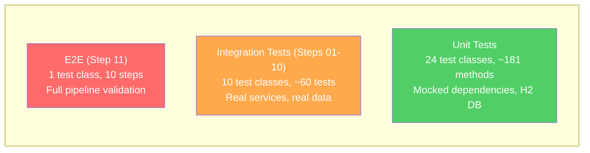
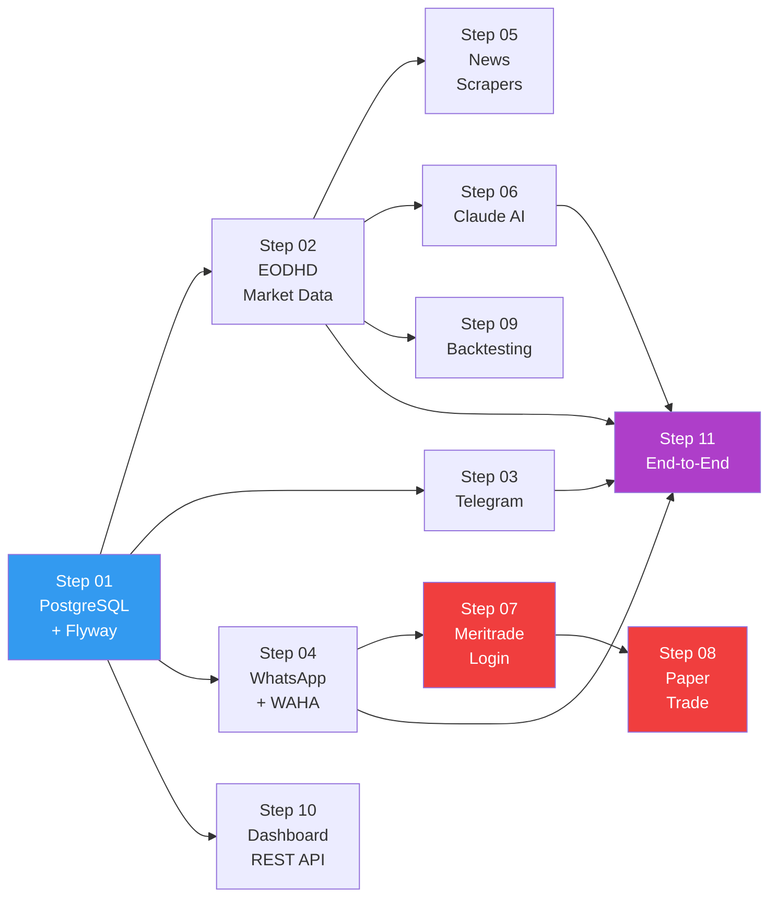

# QA Guide

**Audience**: QA engineers testing the NGX Trading Bot system.

---

## Test Architecture

The project uses a two-tier testing strategy:

| Tier | Framework | Count | Runner | Tag |
|---|---|---|---|---|
| **Unit tests** | JUnit 5 + Mockito + AssertJ | ~181 methods | Maven Surefire | (none) |
| **Integration tests** | JUnit 5 + Spring Boot Test | 11 step files | Maven Failsafe | `@Tag("integration")` |

Unit tests use H2 in-memory database and mocked dependencies. Integration tests hit real PostgreSQL, real EODHD API, real WAHA, and real Trove browser.

### Test Pyramid



### Integration Test Dependency Flow



> **Legend**: Blue = infrastructure, Red = browser (requires Playwright + credentials), Purple = full pipeline

---

## Unit Test Coverage

24 test classes covering all critical modules:

### Risk & Safety
| Class | What It Tests |
|---|---|
| `RiskManagerTest` | All 5 risk checks: max positions, single position size, sector exposure, cash reserve, risk per trade |
| `CircuitBreakerTest` | Daily 5% loss trigger, weekly 10% loss trigger, reset behavior |
| `SettlementCashTrackerTest` | T+2 NGX settlement, T+1 US settlement, overspend prevention, cross-market isolation |

### Execution
| Class | What It Tests |
|---|---|
| `OrderRouterTest` | Kill switch check before routing, risk validation, broker gateway delegation |
| `EndToEndFlowTest` | 5 nested test classes covering: |
| | - Kill switch activation/deactivation/idempotency |
| | - Settlement cash tracking with overspend prevention |
| | - Order recovery (UNCERTAIN status + kill switch activation on failure) |
| | - OTP flow (WhatsApp prompt, reply processing, non-numeric stripping) |
| | - Browser session lock (serialization, release on exception) |
| | - Cross-market cash ledger independence |

### Strategies
| Class | What It Tests |
|---|---|
| `MomentumBreakoutStrategyTest` | Volume spike detection, RSI range filtering, SMA breakout signals |
| `EtfNavArbitrageStrategyTest` | NAV discount entry, premium exit, extreme premium handling |

### Signals & Indicators
| Class | What It Tests |
|---|---|
| `RsiCalculatorTest` | RSI(14) calculation accuracy, edge cases |
| `MacdCalculatorTest` | MACD line, signal line, histogram values |
| `NavDiscountCalculatorTest` | NAV discount/premium percentage calculation |

### Notifications
| Class | What It Tests |
|---|---|
| `MessageFormatterTest` | Trade signal formatting, portfolio summary formatting |
| `TradeApprovalServiceTest` | Approval flow, timeout behavior, default REJECT |

### News
| Class | What It Tests |
|---|---|
| `EventImpactRulesTest` | Event type to impact mapping |
| `NewsEventClassifierTest` | Headline classification into event types |

### Long-term
| Class | What It Tests |
|---|---|
| `DcaExecutorTest` | Monthly DCA execution logic, budget calculations |
| `DividendTrackerTest` | Ex-date tracking, alert generation |
| `PortfolioRebalancerTest` | Drift detection, rebalance action generation |

### Backtest
| Class | What It Tests |
|---|---|
| `PerformanceAnalyzerTest` | Sharpe ratio, max drawdown, win rate calculations |
| `SimulatedOrderExecutorTest` | Simulated fill logic with slippage |

### Data & Discovery
| Class | What It Tests |
|---|---|
| `EodhdApiClientTest` | API response parsing, OHLCV bar construction |
| `WatchlistManagerTest` | Watchlist add/remove, size limits, promotion/demotion |

---

## Integration Test Steps

All integration tests extend `IntegrationTestBase` and require the `integration` Spring profile.

### Step 01: PostgreSQL + Flyway (`Step01_PostgresFlywayIT`)
**Validates**: Database infrastructure is operational.

| Test | Assertion |
|---|---|
| 1.1 PostgreSQL connection is alive | Connection valid, product is "PostgreSQL" |
| 1.2 Flyway ran all 30 migrations | `flyway_schema_history` has >= 30 successful entries |
| 1.3 All expected tables exist | 27 expected tables present in `public` schema |
| 1.4 ohlcv_bars schema | Columns: id, symbol, trade_date, open/high/low/close_price, volume |
| 1.5 trade_orders schema | Columns: id, order_id, symbol, side, quantity, intended_price, status, strategy |
| 1.6 No failed migrations | Zero rows with `success = false` |
| 1.7 Seed data exists | `watchlist_stocks` has > 0 rows (from V20) |

**Prerequisites**: `docker compose up -d postgres`

### Step 02: EODHD Market Data API (`Step02_EodhdApiIT`)
**Validates**: Market data ingestion pipeline works end-to-end.

| Test | Assertion |
|---|---|
| 2.1 API key configured | `EODHD_API_KEY` is not blank |
| 2.2 Fetch OHLCV for ZENITHBANK | Returns bars with positive close price and volume |
| 2.3 Fetch OHLCV for GTCO | Returns recent bars with positive close |
| 2.4 Fetch fundamentals | Returns data (skipped on free-tier API key) |
| 2.5 Screener returns candidates | Returns NGX stocks (skipped on free tier) |
| 2.6 OHLCV persists to DB | All bars have `dataSource = "EODHD"` |
| 2.7 OHLCV values are reasonable | High >= Low, Low <= Close <= High for all bars |

**Prerequisites**: `EODHD_API_KEY` in `.env`

### Step 03: Telegram Notifications (`Step03_TelegramIT`)
**Validates**: Telegram notification delivery.

| Test | Assertion |
|---|---|
| 3.1 Credentials configured | Bot token and chat ID are not blank |
| 3.2 Plain text message | Sends without throwing |
| 3.3 Formatted trade signal | Rich formatted message sends |
| 3.4 Long message | Portfolio summary under 4096 char limit |

**Prerequisites**: `TELEGRAM_BOT_TOKEN` + `TELEGRAM_CHAT_ID` in `.env`. Check your Telegram for received messages.

### Step 04: WhatsApp via WAHA (`Step04_WhatsAppIT`)
**Validates**: WhatsApp notification delivery and OTP handler state.

| Test | Assertion |
|---|---|
| 4.1 Chat ID configured | Contains `@c.us` format |
| 4.2 WAHA running | `/api/sessions` returns response |
| 4.3 Plain text message | Sends without throwing |
| 4.4 Formatted trade alert | Sends trade signal format |
| 4.5 OTP handler initial state | No pending OTPs, max retries = 3 |
| 4.6 Webhook endpoint | `WhatsAppWebhookController` bean loaded |

**Prerequisites**: `docker compose up -d waha`, scan QR code at http://localhost:3000, `WHATSAPP_CHAT_ID` in `.env`

### Step 05: News Scrapers (`Step05_ScrapersIT`)
**Validates**: All 6 news scrapers can connect and parse live websites.

| Test | Source | Notes |
|---|---|---|
| 5a | BusinessDay | Deduplicates by URL — 0 new articles on repeat runs is OK |
| 5b | Nairametrics | Same dedup behavior |
| 5c | SeekingAlpha | Often blocked by anti-bot (403 expected) — soft pass |
| 5d | Reuters RSS | Feed URL may change — soft pass |
| 5e | CBN Press | Website structure may change — soft pass |
| 5f | NGX Price List | May need JS rendering — soft pass |
| 5f-2 | NGX ASI Index | Index value scraping |

**Note**: These hit live websites. Respect rate limits. Soft passes mean the scraper connects but the target site may block/change.

### Step 06: Claude AI API (`Step06_ClaudeAiIT`)
**Validates**: AI analysis integration.

| Test | Assertion |
|---|---|
| 6.1 AI configured | `AI_ENABLED=true`, API key set |
| 6.2 News analysis prompt | Returns response with content + token counts |
| 6.3 Cost tracker | Records cost, calculates daily/monthly totals |
| 6.4 Budget check | Budget not exceeded after one test call |
| 6.5 Structured analysis | Response contains JSON-like structure |

**Prerequisites**: `AI_ENABLED=true`, `AI_API_KEY` in `.env`. Consumes ~$0.01 in API credits.

### Step 07: Meritrade/Trove Browser Login (`Step07_MeritradeLoginIT`)
**Validates**: Full browser automation login flow.

| Test | Assertion |
|---|---|
| 7.1 Credentials configured | Username and password not blank |
| 7.2 Login | Session active after login, screenshot file exists |
| 7.3 Portfolio holdings | Returns Map (may be empty for new accounts) |
| 7.4 Available cash | Returns BigDecimal >= 0 |
| 7.5 FX rate | Returns USD/NGN rate (soft pass) |
| 7.6 Dashboard screenshot | Screenshot file exists on disk |

**Prerequisites**: `MERITRADE_USERNAME` + `MERITRADE_PASSWORD` in `.env`, WAHA running for OTP. Runs in headed mode for visual observation.

### Step 08: Paper Trade (`Step08_PaperTradeIT`)
**Validates**: Real order submission for 1 share.

| Test | Assertion |
|---|---|
| 8.1 Session active | Broker session ready |
| 8.2 Submit BUY LIMIT | Order ID returned for TRANSCORP at NGN 5.00 |
| 8.3 Persist to DB | TradeOrder saved with ID |
| 8.4 Send notification | Telegram notification sent |
| 8.5 Check order status | Status is not blank |
| 8.6 Verify in DB | Order found in database |

**WARNING**: This submits a REAL order with REAL money. Uses cheapest liquid stock (TRANSCORP) at low limit price to minimize risk. Cancel the order after verification.

### Step 09: Backtesting (`Step09_BacktestIT`)
**Validates**: Backtesting engine with real historical data.

| Test | Assertion |
|---|---|
| 9.1 Fetch 1 year historical data | 5 stocks, all have bars |
| 9.2 List strategies | At least 1 strategy registered |
| 9.3 Run backtest | BacktestRun returned with metrics |
| 9.4 Results persist | Rows in backtest_runs and backtest_trades |
| 9.5 Metrics reasonable | Max drawdown <= 0, win rate 0-100% |

### Step 10: Dashboard REST API (`Step10_DashboardIT`)
**Validates**: All REST endpoints return 200 OK.

| Test | Endpoint |
|---|---|
| 10.1 | `GET /api/portfolio` |
| 10.2 | `GET /api/fx` |
| 10.3 | `GET /api/settlement` |
| 10.4 | `GET /api/performance` |
| 10.5 | `GET /api/signals` |
| 10.6 | `GET /api/news` |
| 10.7 | `GET /api/ai/cost` |
| 10.8 | `GET /api/discovery/active` |
| 10.9 | `GET /api/discovery/candidates` |
| 10.10 | `GET /api/backtest/runs` |
| 10.11 | `GET /api/backtest/strategies` |
| 10.12 | `GET /actuator/health` (expects "UP") |
| 10.13 | `GET /api/killswitch` |
| 10.14 | `GET /api/dividends` |

### Step 11: End-to-End Pipeline (`Step11_EndToEndIT`)
**Validates**: Complete signal-to-notification pipeline with real data (no real order submission).

| Step | What It Does |
|---|---|
| E2E 1/10 | Fetch 3 months OHLCV for ZENITHBANK |
| E2E 2/10 | Calculate RSI(14) and MACD |
| E2E 3/10 | Scrape news from BusinessDay |
| E2E 4/10 | AI analysis of news + market data (if enabled) |
| E2E 5/10 | Generate mock BUY signal with price/SL/target |
| E2E 6/10 | Verify kill switch OFF, circuit breakers OK |
| E2E 7/10 | Send approval request via Telegram |
| E2E 8/10 | Simulate auto-approval |
| E2E 9/10 | Record simulated trade to PostgreSQL |
| E2E 10/10 | Send confirmation via Telegram + WhatsApp |

---

## Running Tests

### Unit Tests
```bash
mvn test                      # Runs all unit tests (excludes @Tag("integration"))
```

### Integration Tests
```bash
# 1. Start infrastructure
docker compose up -d postgres waha

# 2. Ensure .env file has all required keys

# 3. Run integration tests
mvn verify -Pintegration

# 4. Or run a specific step
mvn verify -Pintegration -Dtest="Step01_PostgresFlywayIT"
```

### Test Profiles
| Profile | Surefire Config | What Runs |
|---|---|---|
| (default) | `excludedGroups=integration` | Unit tests only |
| `integration` | `groups=integration` | Integration tests only |

---

## Manual Testing Checklist

### Login Flow
- [ ] Bot navigates to `https://app.trovefinance.com/login`
- [ ] Email and password fields are filled
- [ ] Login button is clicked
- [ ] If OTP screen appears, bot sends WhatsApp/email prompt
- [ ] OTP is entered and verified
- [ ] Dashboard loads (verify via screenshot in `./screenshots/`)

### OTP Verification
- [ ] WhatsApp message received asking for OTP
- [ ] Reply with 6-digit code
- [ ] Bot processes code and enters it
- [ ] Gmail IMAP reader extracts OTP from Trove emails (if email OTP enabled)

### Kill Switch
- [ ] Activate kill switch via `KillSwitchService.activate(reason)`
- [ ] Verify all trading halts immediately
- [ ] Verify urgent WhatsApp/Telegram notification sent
- [ ] Deactivate and verify trading resumes
- [ ] Verify multiple activations only send one notification

### Circuit Breaker
- [ ] Simulate 5% daily loss — verify daily circuit breaker trips
- [ ] Verify no new orders routed until next day
- [ ] Simulate 10% weekly loss — verify weekly circuit breaker trips
- [ ] Verify trading halts until Monday

### Screenshots
- [ ] Screenshots saved to `./screenshots/` directory
- [ ] File names contain timestamp and context
- [ ] Old screenshots cleaned up after retention period (72h default, 48h prod)

---

## Known Limitations

1. **Portfolio selectors**: CSS selectors for reading portfolio holdings need a real account with actual positions to validate. Empty portfolios return empty maps.
2. **`submitOrder()` not yet live**: The order submission method in `TroveBrowserAgent` is implemented but not yet fully wired for production use. Step 08 (Paper Trade) validates this path.
3. **Account verification**: Trove requires account verification before trading is enabled. New accounts may fail at Step 07.
4. **SeekingAlpha scraper**: Frequently blocked by anti-bot measures (403). This is expected behavior.
5. **RSS feeds**: Reuters and other RSS feed URLs may change without notice, causing soft failures in Step 05.
6. **EODHD free tier**: Fundamentals and screener endpoints require a paid EODHD plan. Tests gracefully skip these.

---

## Bug Reporting Template

```
### Summary
[One-line description]

### Steps to Reproduce
1. [Step 1]
2. [Step 2]
3. [Step 3]

### Expected Behavior
[What should happen]

### Actual Behavior
[What actually happened]

### Environment
- Profile: [dev/prod/integration]
- Java version: [output of java --version]
- Docker running: [yes/no, which services]
- Browser mode: [headless/headed]

### Logs
[Relevant log output — check com.ngxbot log level]

### Screenshots
[Attach screenshots from ./screenshots/ if relevant]

### Integration Test Step
[If related to a specific step, e.g., "Step 07 — Login fails at OTP entry"]
```

---

## Related Docs
- [Developer Guide](./DEVELOPER_GUIDE.md) — Architecture, module breakdown, setup
- [API Reference](./API_REFERENCE.md) — REST API documentation
- [Deployment Guide](./DEPLOYMENT_GUIDE.md) — Production deployment and operations
- [Product Spec](./PRODUCT_SPEC.md) — Feature inventory and roadmap
